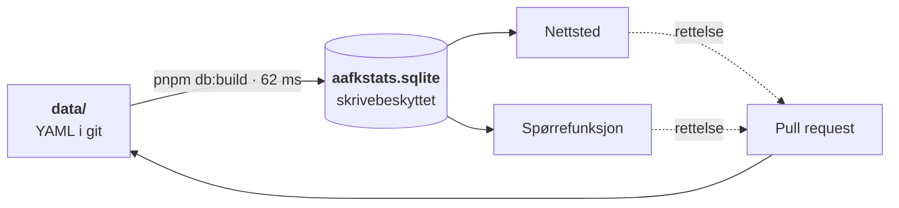

<div align="center">

# AaFK-arkivet

**Fritt og åpent arkiv over Aalesunds Fotballklubbs kamphistorikk —
bygget som en portal der spørsmålet er hovedinngangen.**

[](https://github.com/mlervaag/aafkstats/actions/workflows/ci.yml)
[](LICENSE)
[](DATA_LICENSE.md)
[](package.json)
[](tsconfig.base.json)
[](apps/web)

[**aafkstats.vercel.app**](https://aafkstats.vercel.app) ·
[Datasettet](https://aafkstats.vercel.app/data) ·
[Arkitektur](docs/ARKITEKTUR.md) ·
[Datamodell](docs/DATAMODELL.md) ·
[Bidra](CONTRIBUTING.md)

</div>

---

> «Når tapte vi sist med 6 mål på hjemmebane?»

Det spørsmålet er hele premisset. Et arkiv som bare viser tabeller tvinger deg til å lete;
dette skal svare. Alt ligger som YAML-filer i [`data/`](data), én fil per kamp, og ved hver
utrulling bygges de om til en skrivebeskyttet SQLite-fil som nettstedet og spørrefunksjonen
leser fra.

## Innhold

- [Arkivet i tall](#arkivet-i-tall)
- [Slik henger det sammen](#slik-henger-det-sammen)
- [Kom i gang](#kom-i-gang)
- [Kommandoer](#kommandoer)
- [Datamodellen](#datamodellen)
- [Spørrefunksjonen og grensene rundt den](#spørrefunksjonen-og-grensene-rundt-den)
- [Kilder og rettigheter](#kilder-og-rettigheter)
- [Oppbygging](#oppbygging)
- [Dokumentasjon](#dokumentasjon)
- [Bidra](#bidra)
- [Lisens](#lisens)
- [Status](#status)

## Arkivet i tall

| | |
|---|---|
| **1 040 kamper** | 829 seriekamper · 203 cupkamper · 8 treningskamper |
| **85 sesonger** | 1917–2026. Cupen tilbake til 1917, serien til 1951 |
| **128 klubber · 84 stadion** | Med tidsavhengige navn, så 1975-kampen viser 1975-navnet |
| **523 kamper med hendelser** | Mål, kort og bytter. 527 med lagoppstilling, 305 med tilskuertall |
| **6 kilder** | Hver med rettighetsstatus som data, ikke som prosa |

<sub>Tall per 3. august 2026. <code>pnpm validate</code> skriver ut de gjeldende.</sub>

## Slik henger det sammen



**Git er sannheten.** Arkivfilen er et derivat som når som helst kan kastes og bygges opp
igjen fra filene. Det er dét som holder arkivet fritt og åpent: alt kan klones, forkes og
rettes via pull request, og hver rettelse har en historikk.

**Hvorfor en fil og ikke en databasetjeneste.** Dataene endrer seg bare når noen merger en
PR, og hver merge utløser en ny utrulling. En byggetidsfil er derfor fersk per definisjon —
og hele arkivet bygges på under ett tidels sekund. Det gir null tjenester å drifte, ingen
kaldstart, og tester som kjører likt overalt fordi de bygger sin egen fil. Skrivetilstanden
som en database ellers ville båret (rate-limiting, bruksmåling) hører hjemme foran
applikasjonen, ikke inni datasettet.

Den lange versjonen, med avveiningene bak hvert valg, står i
[**docs/ARKITEKTUR.md**](docs/ARKITEKTUR.md).

## Kom i gang

Krever [Node 22+](https://nodejs.org) og [pnpm 10+](https://pnpm.io).

```sh
git clone https://github.com/mlervaag/aafkstats.git
cd aafkstats
pnpm install
cp .env.example .env

AAFK_DATA_DIR=fixtures/data pnpm db:build   # bygger apps/web/.data/aafkstats.sqlite
pnpm dev                                    # http://localhost:3000
```

Uten `AAFK_DATA_DIR` bygges arkivet fra de ekte kampene i `data/`. Arkivfilen ligger ikke i
git: binærfiler gir ubrukelige differ, og den bygges fra kildefilene på et øyeblikk uansett.

For at spørrefunksjonen skal virke må `ANTHROPIC_API_KEY` settes i `.env`. Resten av
nettstedet fungerer uten.

[`fixtures/data`](fixtures/README.md) er et lite konstruert arkiv brukt til utvikling og
tester. Det ekte arkivet i `data/` fylles av de avgrensede verktøyene i
[`packages/ingest`](packages/ingest) — men hver kilde må først gjennom en deknings- og
rettighetsvurdering.

## Kommandoer

| Kommando | Hva den gjør |
|---|---|
| `pnpm validate` | Validerer hele arkivet: skjema, referanser, duplikater |
| `pnpm db:build` | Bygger arkivfilen fra `data/`. Respekterer `AAFK_DATA_DIR` |
| `pnpm dev` | Starter nettstedet på port 3000 |
| `pnpm test` | Kjører testene. Ingen tjeneste kreves — de bygger sitt eget arkiv |
| `pnpm typecheck` | Typesjekker pakkene og nettstedet |
| `pnpm lint` | ESLint over hele monorepoet |
| `pnpm build` | Bygger arkivfilen og deretter nettstedet |
| `pnpm ingest:fotmob -- --league ID --season ÅR --competition ID` | Tørrkjører én eksplisitt FotMob-sesong |
| `pnpm ingest:rsssf -- --season ÅR --division SIDE --competition ID` | Tørrkjører én eksplisitt RSSSF-sesong |
| `pnpm ingest:rsssf-discover -- --from ÅR --to ÅR` | Kartlegger hva RSSSF har. Skriver aldri data |

Innhøstingen tørrkjører alltid som standard. `--write` er et eget valg, og det krever at
kilden er avklart for publisering — se [Kilder og rettigheter](#kilder-og-rettigheter).

## Datamodellen

Fire valg som resten hviler på:

1. **Stabile ID-er.** Kamp-ID = filnavn = `YYYY-MM-DD-hjemmelag-bortelag`, pluss `aliases`
   mot eksterne kilder. Gjør re-scraping idempotent.
2. **Navn er tidsavhengige.** En kamp fra 1998 viser «Tippeligaen», en fra 2024 viser
   «Eliteserien» — samme konkurranse, riktig navn på riktig dato.
3. **Konkurransetype driver navigasjonen.** Liga/cup/europa/trening kommer fra data, ikke
   fra hardkoding.
4. **Kilde og konflikt per felt.** Hver opplysning bærer sin egen kilde. Når kilder er
   uenige, bevares uenigheten i `conflicts[]` framfor å skjules.

Bare seks felt er påkrevd på en kamp. En kamp fra 1930 der vi kjenner dato og motstander
skal kunne ligge i arkivet med `confidence: probable` og forbedres senere — det er bedre
enn å holdes utenfor til noen har full oversikt.

Feltreferansen står i [**docs/DATAMODELL.md**](docs/DATAMODELL.md); skjemaet som håndhever
den ligger i [`packages/schema`](packages/schema).

### AaFK-perspektivet

`matches`-viewet flater hver kamp ut til AaFKs synsvinkel: `is_home`, `opponent`,
`aafk_score`, `goal_difference`, `result`. Uten dette må enhver spørring først finne ut
hvilken side vi spilte på. Med det blir åpningsspørsmålet én `WHERE`-setning:

```sql
SELECT date, opponent, aafk_score, opponent_score, url
FROM matches
WHERE is_home = 1 AND result = 'T' AND goal_difference <= -6
ORDER BY date DESC LIMIT 1;
```

Tabellene bak viewene heter `core_*` og er utilgjengelige for spørrefunksjonen. Skillet
mellom rådata og publisert datasett er dermed synlig i navnet, ikke bare i dokumentasjonen.

## Spørrefunksjonen og grensene rundt den

Chatten kan skrive og kjøre egne SELECT-spørringer. Det er dét som gjør at den kan svare på
spørsmål ingen har laget et ferdig oppslag for. Fem lag holder det trygt:

| Lag | Håndheves av |
|---|---|
| Filen åpnes med `readOnly` | **SQLite** |
| Spørringen kjøres i en egen prosess som drepes med `SIGKILL` ved timeout | **operativsystemet** |
| Én setning, kun SELECT/WITH, ingen `core_*` eller `sqlite_*` | koden |
| Radtak på 200 | koden |
| Logging av hver spørring | koden |

Bare de to første er sikkerhet. De tre siste finnes for å gi modellen forståelige
feilmeldinger — hele opplegget skal være trygt selv om de skulle svikte.

SQLite har ingen `statement_timeout`, og en spørring som blokkerer i motoren lar seg ikke
avbryte fra JavaScript: kallet er synkront og holder tråden. En `Worker` ville ikke hjulpet,
for `terminate()` venter på at det pågående kallet returnerer. Derfor kjøres hver spørring i
en egen Node-prosess som avlives utenfra. Kostnaden er rundt 45 ms per spørring, og det er
den eneste måten grensen faktisk holder.

Rate-limiting og bruksmåling ligger foran applikasjonen — Vercel Firewall og et kostnadstak
i Anthropic Console — ikke i datasettet. Testene i
[`packages/db/test/`](packages/db/test) prøver å bryte hvert lag, inkludert direkte mot
arkivfilen utenom koden.

Datasettdokumentasjonen på [`/data`](https://aafkstats.vercel.app/data) er **samme kilde**
som chattens systemprompt ([`packages/query/src/dataset.ts`](packages/query/src/dataset.ts)).
Det finnes ingen skjult beskrivelse modellen har og brukeren ikke har, og en test feiler
hvis dokumentasjonen ikke stemmer med databasen.

## Kilder og rettigheter

To kilder er i bruk, og de dekker hver sin del av historien:

| Kilde | Periode | Gir |
|---|---|---|
| [FotMob](docs/data/FOTMOB_DEKNINGSTAK.md) | 2010→ | Kampfakta, hendelser, lagoppstillinger, statistikk, tilskuertall |
| [RSSSF Norway](docs/data/RSSSF_DEKNING.md) | ←2009 | Dato, lag, resultat og runde. Ingen detaljer |

Begge dokumentene sier hvor kilden slutter og hvorfor — det er lettere å lese enn å
gjenoppdage. Hvilke kilder som kan brukes, og hvordan, er kartlagt i
[Kildekart og innhentingsstrategi](docs/research/KILDEKART_OG_INNHENTINGSSTRATEGI.md).
**Les den før du skriver en adapter** — flere av de opplagte kildene er røde.

### «Kan hentes» er ikke «kan publiseres»

At et sluttresultat er et faktum uten opphavsrett sier ingenting om to andre ting:
databasevernet på samlingen det ble hentet fra, og vilkårene kilden selv har satt. De to
spørsmålene holdes derfor i hvert sitt felt i `data/sources/*.yaml`:

```yaml
automatedAccess: allowed                    # kan vi hente?
publicRedistribution: permission_required   # kan vi publisere videre?
permissionStatus: pending
termsCheckedAt: 2026-08-03
robotsCheckedAt: 2026-08-03
```

Innhøstings-CLI-ene leser statusen før nettverkskallet. Tørrkjøring krever bare at kilden
kan hentes; `--write` krever i tillegg at den kan publiseres. `unknown` regnes aldri som et
ja.

`accepted_risk` betyr at vilkårene er lest, at bruken ikke er uttrykkelig tillatt, og at
prosjekteier likevel har besluttet å gå videre — for et åpent, ikke-kommersielt
supporterarkiv over offentlige kampfakta. Statusen krever begrunnelse, håndhevet av
skjemaet. Poenget med å skille den fra `granted` er at arkivet skal si hva det vet framfor
å pynte på det.

Statusen vises offentlig på [`/om`](https://aafkstats.vercel.app/om). Et arkiv som lever av
etterprøvbarhet bør ikke gjemme sin egen rettighetssituasjon.

## Oppbygging

```
aafkstats/
├── data/                 Arkivet. YAML, én fil per kamp
├── fixtures/data/        Konstruert testarkiv med deterministiske svar
├── packages/
│   ├── schema/           Zod-skjema, validering, avledning til AaFK-perspektiv
│   ├── db/               SQLite-skjema, byggesteget, SQL-guardrails
│   ├── ingest/           Avgrenset innhøsting, cache, normalisering og reconcile
│   └── query/            Datasettdokumentasjon, verktøy og systemprompt
├── apps/web/             Next.js: portal, /api/chat, /data
└── docs/                 Arkitektur, datamodell, kildekart og dekningsnotater
```

Hver pakke har sin egen README med formål, offentlig flate og de valgene som er verdt å
kjenne til:
[`schema`](packages/schema/README.md) ·
[`db`](packages/db/README.md) ·
[`ingest`](packages/ingest/README.md) ·
[`query`](packages/query/README.md) ·
[`web`](apps/web/README.md)

## Dokumentasjon

| Dokument | Svarer på |
|---|---|
| [**Arkitektur**](docs/ARKITEKTUR.md) | Hvordan delene henger sammen, og hvorfor de er slik |
| [**Datamodell**](docs/DATAMODELL.md) | Hvert felt i YAML-filene, med regler og eksempler |
| [**Bidra**](CONTRIBUTING.md) | Hvordan du retter en kamp eller sender kode |
| [Kildekart](docs/research/KILDEKART_OG_INNHENTINGSSTRATEGI.md) | Hvilke kilder som finnes, og hvilke som er røde |
| [Plan fra pilot til arkiv](docs/PLAN_FRA_PILOT_TIL_ARKIV.md) | Hva som bygges, i hvilken rekkefølge |
| [FotMob-dekningstak](docs/data/FOTMOB_DEKNINGSTAK.md) | Hvor den moderne kilden slutter |
| [RSSSF-dekning](docs/data/RSSSF_DEKNING.md) | Hvordan hullet under den ble fylt |
| [Sikkerhet](SECURITY.md) | Hvordan du melder fra om et sikkerhetsproblem |

## Bidra

Feil i arkivet er ikke pinlige — de er poenget med å ha det i git. Fant du en gal dato, en
manglende kamp eller en målscorer på feil lag, er det én YAML-fil å rette og én pull request
å sende.

```sh
$EDITOR data/seasons/2019/matches/2019-06-19-aalesunds-fk-molde-fk.yaml
pnpm validate
```

Full framgangsmåte, feltforklaringer og krav til kilder står i
[**CONTRIBUTING.md**](CONTRIBUTING.md). Deltakelse i prosjektet skjer under
[Code of Conduct](CODE_OF_CONDUCT.md).

## Lisens

Kode under [MIT](LICENSE). Egne tekster og arkivets eget redaksjonelle innhold under
[CC BY 4.0](DATA_LICENSE.md). Tredjepartskilder har egne vilkår — se
[`DATA_LICENSE.md`](DATA_LICENSE.md) og [`data/sources/`](data/sources).

> **Referat skrives alltid for dette arkivet — aldri kopiert fra avis eller klubbside.**
> Fakta er frie, tekst er det ikke.

## Status

Grunnmuren står: datamodell, database, guardrails, portal og datasettdokumentasjon.
Arkivet dekker 1 040 kamper fra 1917 til i dag, med detaljer (hendelser, lagoppstillinger,
statistikk) fra 2010 og framover. Hovedfeltet gir direkte kamptreff mens brukeren skriver år
og motstander; Enter sender i stedet teksten til AI-søket.

Gjenstår blant annet europacupkamper, rettighetsavklart innhøsting, REST-API, MCP-server, et
automatisk bidragsskjema og agentrutinene. Rekkefølgen står i
[planen](docs/PLAN_FRA_PILOT_TIL_ARKIV.md).

<div align="center">
<sub>Et supporterprosjekt. Ikke tilknyttet Aalesunds Fotballklubb.</sub>
</div>
