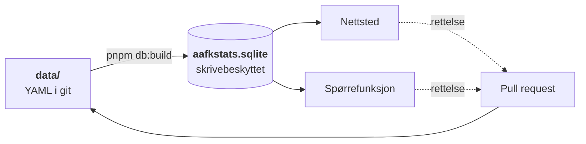

<div align="center">


# AaFK-arkivet

**Fritt og åpent arkiv over Aalesunds Fotballklubbs kamphistorikk —
bygget som en portal der spørsmålet er hovedinngangen.**

[](https://github.com/mlervaag/aafkstats/actions/workflows/ci.yml)
[](LICENSE)
[](DATA_LICENSE.md)
[](package.json)
[](tsconfig.base.json)
[](apps/web)

[**aafkarkivet.no**](https://aafkarkivet.no) ·
[Datasettet](https://aafkarkivet.no/data) ·
[Arkitektur](docs/ARKITEKTUR.md) ·
[Datamodell](docs/DATAMODELL.md) ·
[Bidra](CONTRIBUTING.md)

</div>

---

> «Når tapte vi sist med 6 mål på hjemmebane?»

Det spørsmålet er hele premisset. Et arkiv som bare viser tabeller tvinger deg til å lete;
dette skal svare. Alt ligger som YAML-filer i [`data/`](data), én fil per kamp, og ved hver
utrulling bygges de om til en skrivebeskyttet SQLite-fil som nettstedet og spørrefunksjonen
leser fra.

## Innhold

- [Arkivet i tall](#arkivet-i-tall)
- [Slik henger det sammen](#slik-henger-det-sammen)
- [Kom i gang](#kom-i-gang)
- [Kommandoer](#kommandoer)
- [Datamodellen](#datamodellen)
- [Spørrefunksjonen og grensene rundt den](#spørrefunksjonen-og-grensene-rundt-den)
- [Kilder og rettigheter](#kilder-og-rettigheter)
- [Oppbygging](#oppbygging)
- [Dokumentasjon](#dokumentasjon)
- [Bidra](#bidra)
- [Måling](#måling)
- [Lisens](#lisens)
- [Status](#status)

## Arkivet i tall

| | |
|---|---|
| **1 501 kamper** | Kamper registrert totalt i arkivet |
| **733 kildedokumenterte resultatoppføringer** | Resultatobservasjoner bevart direkte fra historiske kilder; selve oppføringene teller ikke som kamper. **650 mangler fortsatt kobling til en kanonisk kamp.** |
| **89 år med kanoniske kamper** | 1915–2026, år med minst én registrert kamp. Enkeltkamper tilbake til 1915, cupen til 1917, regionale kretskamper til 1920 og nasjonal serie til 1951 |
| **106 år med historisk kampinformasjon** | De kanoniske årene over, pluss år som foreløpig bare har kildedokumenterte resultater. Sesongoversikten viser disse |
| **189 klubber · 97 stadion** | Med tidsavhengige navn, så 1975-kampen viser 1975-navnet |
| **450 personer** | Registrerte spillere, trenere, ledere, stiftere, prosjektpersoner og hederspersoner med kildeførte detaljer eller avvikende navn |
| **9 dataleverandører** | Der data hentes digitalt fra, hver med rettighetsstatus som data og ikke som prosa |
| **237 historiske kilder** | Bøker, medlemsblad, årsmeldinger, nyhetssaker og andre dokumenter en enkelt opplysning kan peke på, med sidetall der det finnes |
| **25 historiske observasjoner** | Kildeførte enkeltfakta og hendelser som ikke hører til én bestemt kamp — verv, protester, pokaler, baneåpninger — vist på personen, sesongen, kampen eller banen de gjelder |
| **98 publikasjoner analysert** | 3 211 ALTO-sider, 139 søkbare sider og 4 814 faktakandidater uten lagret OCR-prosa |
| **11 historiesider gjennomgått** | AaFKs offisielle leder-, utmerkelses-, stiftelses-, arkiv- og hjemmebanefakta er strukturert med lenke tilbake |
| **Brukerbidrag** | Innsendte observasjoner og minner hentet fra redaksjonell innboks |

<sub>Tallene oppdateres kontinuerlig. <code>pnpm validate</code> skriver ut de gjeldende.</sub>

## Slik henger det sammen



**Git er sannheten.** Arkivfilen er et derivat som når som helst kan kastes og bygges opp
igjen fra filene. Det er dét som holder arkivet fritt og åpent: alt kan klones, forkes og
rettes via pull request, og hver rettelse har en historikk.

**Hvorfor en fil og ikke en databasetjeneste.** Dataene endrer seg bare når noen merger en
PR, og hver merge utløser en ny utrulling. En byggetidsfil er derfor fersk per definisjon —
og hele arkivet bygges på under ett tidels sekund. Det gir null tjenester å drifte, ingen
kaldstart, og tester som kjører likt overalt fordi de bygger sin egen fil. Skrivetilstanden
som en database ellers ville båret (rate-limiting, bruksmåling) hører hjemme foran
applikasjonen, ikke inni datasettet.

Den lange versjonen, med avveiningene bak hvert valg, står i
[**docs/ARKITEKTUR.md**](docs/ARKITEKTUR.md).

## Kom i gang

Krever [Node 22+](https://nodejs.org) og [pnpm 10+](https://pnpm.io).

```sh
git clone https://github.com/mlervaag/aafkstats.git
cd aafkstats
pnpm install
cp .env.example .env

AAFK_DATA_DIR=fixtures/data pnpm db:build   # bygger apps/web/.data/aafkstats.sqlite
pnpm dev                                    # http://localhost:3000
```

Uten `AAFK_DATA_DIR` bygges arkivet fra de ekte kampene i `data/`. Arkivfilen ligger ikke i
git: binærfiler gir ubrukelige differ, og den bygges fra kildefilene på et øyeblikk uansett.

For at spørrefunksjonen skal virke må én API-nøkkel settes i `.env`: enten
`ANTHROPIC_API_KEY` eller `OPENAI_API_KEY`. Er begge satt, brukes Anthropic med mindre
`AAFK_CHAT_PROVIDER=openai` sier noe annet. Resten av nettstedet fungerer uten nøkkel.

[`fixtures/data`](fixtures/README.md) er et lite konstruert arkiv brukt til utvikling og
tester. Det ekte arkivet i `data/` fylles av de avgrensede verktøyene i
[`packages/ingest`](packages/ingest) — men hver kilde må først gjennom en deknings- og
rettighetsvurdering.

## Kommandoer

| Kommando | Hva den gjør |
|---|---|
| `pnpm validate` | Validerer hele arkivet: skjema, referanser, duplikater |
| `pnpm db:build` | Bygger arkivfilen fra `data/`. Respekterer `AAFK_DATA_DIR` |
| `pnpm --filter @aafkstats/ingest nb-extract --write --apply` | Gjenopptakbart NB-uttrekk; lagrer kandidater og kobler bare entydige kampresultater |
| `pnpm dev` | Starter nettstedet på port 3000 |
| `pnpm test` | Kjører testene. Ingen tjeneste kreves — de bygger sitt eget arkiv |
| `pnpm typecheck` | Typesjekker pakkene og nettstedet |
| `pnpm lint` | ESLint over hele monorepoet |
| `pnpm build` | Bygger arkivfilen og deretter nettstedet |
| `pnpm etter-kamp` | Holder sesongen à jour: egne kamper som er spilt, og tabellen for hver seriesesong som pågår |
| `pnpm ingest:fotmob -- --league ID --season ÅR --competition ID` | Tørrkjører én eksplisitt FotMob-sesong |
| `pnpm ingest:rsssf -- --season ÅR --division SIDE --competition ID` | Tørrkjører én eksplisitt RSSSF-sesong |
| `pnpm ingest:rsssf-discover -- --from ÅR --to ÅR` | Kartlegger hva RSSSF har. Skriver aldri data |
| `pnpm ingest:fotmob-standings -- --league ID --season ÅR --competition ID` | Tørrkjører tabellen og plasseringskurven for én sesong. Den eneste som kan hente en sesong som pågår |

Innhøstingen tørrkjører alltid som standard. `--write` er et eget valg, og det krever at
kilden er avklart for publisering — se [Kilder og rettigheter](#kilder-og-rettigheter).

## Datamodellen

Fire valg som resten hviler på:

1. **Stabile ID-er.** Kamp-ID = filnavn = `YYYY-MM-DD-hjemmelag-bortelag`, pluss `aliases`
   mot eksterne kilder. Gjør re-scraping idempotent.
2. **Navn er tidsavhengige.** En kamp fra 1998 viser «Tippeligaen», en fra 2024 viser
   «Eliteserien» — samme konkurranse, riktig navn på riktig dato.
3. **Konkurransetype driver navigasjonen.** Liga/cup/europa/trening kommer fra data, ikke
   fra hardkoding.
4. **Kilde og konflikt per felt.** Hver opplysning bærer sin egen kilde. Når kilder er
   uenige, bevares uenigheten i `conflicts[]` framfor å skjules.

Bare seks felt er påkrevd på en kamp. En kamp fra 1930 der vi kjenner dato og motstander
skal kunne ligge i arkivet med `confidence: probable` og forbedres senere — det er bedre
enn å holdes utenfor til noen har full oversikt.

Feltreferansen står i [**docs/DATAMODELL.md**](docs/DATAMODELL.md); skjemaet som håndhever
den ligger i [`packages/schema`](packages/schema).

### AaFK-perspektivet

`matches`-viewet flater hver kamp ut til AaFKs synsvinkel: `is_home`, `opponent`,
`aafk_score`, `goal_difference`, `result`. Uten dette må enhver spørring først finne ut
hvilken side vi spilte på. Med det blir åpningsspørsmålet én `WHERE`-setning:

```sql
SELECT date, opponent, aafk_score, opponent_score, url
FROM matches
WHERE is_home = 1 AND result = 'T' AND goal_difference <= -6
ORDER BY date DESC LIMIT 1;
```

Tabellene bak viewene heter `core_*` og er utilgjengelige for spørrefunksjonen. Skillet
mellom rådata og publisert datasett er dermed synlig i navnet, ikke bare i dokumentasjonen.

## Spørrefunksjonen og grensene rundt den

Chatten kan skrive og kjøre egne SELECT-spørringer. Det er dét som gjør at den kan svare på
spørsmål ingen har laget et ferdig oppslag for. Seks lag holder det trygt:

| Lag | Håndheves av |
|---|---|
| Filen åpnes med `readOnly` | **SQLite** |
| Spørringen kjøres i en egen prosess som drepes med `SIGKILL` ved timeout | **operativsystemet** |
| Prosessen får et miljø uten hemmeligheter, og et tak på haugen | **operativsystemet** |
| Én setning, kun SELECT/WITH, ingen `core_*`, `sqlite_*` eller `pragma_*` | koden |
| Radtak på 200, og et tak på 256 kB uansett hvor mange rader det er | koden |
| Logging av hver spørring | koden |

De tre første er sikkerhet. Resten finnes for å gi modellen forståelige
feilmeldinger — hele opplegget skal være trygt selv om de skulle svikte.

Navnekontrollen er unntaket: den *er* grensen mot `core_`-tabellene, for SQLite har
ingen roller og kan ikke gi leserett på viewene alene. Derfor leses spørringen i to
utgaver. Setningsdeling og nøkkelord sjekkes mot en utgave der strenger og siterte
navn er blanket ut, så `WHERE note = 'a;b'` ikke leses som to setninger. Navnene
sjekkes mot en utgave der siterte identifikatorer er pakket ut, for SQLite godtar
`"core_matches"`, `[core_matches]` og `` `core_matches` `` som samme tabell — leser
kontrollen bare den første utgaven, gjemmer et par anførselstegn navnet for filteret
og viser det til motoren.

Radtaket sier ingenting om størrelsen: én celle kan være vilkårlig stor, og
resultatet går rett inn i modellens kontekst. Derfor er det også et tak i byte, og
det er like mye en kostnadsgrense som en minnegrense.

SQLite har ingen `statement_timeout`, og en spørring som blokkerer i motoren lar seg ikke
avbryte fra JavaScript: kallet er synkront og holder tråden. En `Worker` ville ikke hjulpet,
for `terminate()` venter på at det pågående kallet returnerer. Derfor kjøres hver spørring i
en egen Node-prosess som avlives utenfra. Kostnaden er rundt 45 ms per spørring, og det er
den eneste måten grensen faktisk holder.

Rate-limiting og bruksmåling ligger foran applikasjonen — Vercel Firewall og et kostnadstak
hos den leverandøren nøkkelen hører til (Anthropic Console eller OpenAI-plattformen) — ikke i
datasettet. Testene i
[`packages/db/test/`](packages/db/test) prøver å bryte hvert lag, inkludert direkte mot
arkivfilen utenom koden.

Det som *kan* koste penger, er derfor avgrenset i selve forespørselen: spørsmålet er
begrenset til 1000 tegn, samtalehistorikken klienten sender med til seks meldinger og
12 000 tegn til sammen, og kroppen leses aldri større enn 64 kB. Uten det siste er de
andre grensene rådgivende — vi har lest og parset alt før første kontroll kjører.
Historikken kontrolleres også på rolle: den kommer fra klienten, og bare `user` og
`assistant` skal videre til modellen.

Chatten avviser POST-kall som kommer fra et annet nettsted. Det er ikke CSRF i vanlig
forstand, for det finnes ingen innlogging å misbruke — det er regningen som står på spill:
`Content-Type: text/plain` gjør en POST til en «simple request» uten forhåndssjekk, og da
kan en hvilken som helst side sette sine besøkendes nettlesere til å tømme API-budsjettet.
Kall uten `Origin` slipper gjennom, for de stoppes av fartsgrensen i stedet.

Datasettdokumentasjonen på [`/data`](https://aafkarkivet.no/data) er **samme kilde**
som chattens systemprompt ([`packages/query/src/dataset.ts`](packages/query/src/dataset.ts)).
Det finnes ingen skjult beskrivelse modellen har og brukeren ikke har, og en test feiler
hvis dokumentasjonen ikke stemmer med databasen.

## Kilder og rettigheter

Fire kilder er i bruk for kampdata, og de utfyller hverandre gjennom historien:

| Kilde | Periode | Gir |
|---|---|---|
| [FotMob](docs/data/FOTMOB_DEKNINGSTAK.md) | 2010→ | Kampfakta, hendelser, lagoppstillinger, statistikk, tilskuertall |
| NFF Fotballdata (fotball.no) | 1982–2000 | Runde, dato, motstander, resultat og tabeller for utvalgte sesonger |
| [RSSSF Norway](docs/data/RSSSF_DEKNING.md) | ←2010 | Dato, lag, resultat og runde for eldste sesonger |
| [Sunnmøre Fotballkrets](docs/research/SFK_ARSRAPPORTER_INNHENTINGSPLAN.md) | 1952–2025 | Årsrapporter med historiske tabeller, cupresultater og kretsfakta |

Dekningsdokumentene sier hvor kildene slutter og hvorfor — det er lettere å lese enn å
gjenoppdage. Hvilke kilder som kan brukes, og hvordan, er kartlagt i
[Kildekart og innhentingsstrategi](docs/research/KILDEKART_OG_INNHENTINGSSTRATEGI.md).
**Les den før du skriver en adapter** — flere av de opplagte kildene er røde.

### «Kan hentes» er ikke «kan publiseres»

At et sluttresultat er et faktum uten opphavsrett sier ingenting om to andre ting:
databasevernet på samlingen det ble hentet fra, og vilkårene kilden selv har satt. De to
spørsmålene holdes derfor i hvert sitt felt i `data/providers/*.yaml`:

```yaml
automatedAccess: allowed                    # kan vi hente?
publicRedistribution: permission_required   # kan vi publisere videre?
permissionStatus: pending
termsCheckedAt: 2026-08-03
robotsCheckedAt: 2026-08-03
```

Innhøstings-CLI-ene leser statusen før nettverkskallet. Tørrkjøring krever bare at kilden
kan hentes; `--write` krever i tillegg at den kan publiseres. `unknown` regnes aldri som et
ja.

`accepted_risk` betyr at vilkårene er lest, at bruken ikke er uttrykkelig tillatt, og at
prosjekteier likevel har besluttet å gå videre — for et åpent, ikke-kommersielt
supporterarkiv over offentlige kampfakta. Statusen krever begrunnelse, håndhevet av
skjemaet. Poenget med å skille den fra `granted` er at arkivet skal si hva det vet framfor
å pynte på det.

Statusen vises offentlig på [`/om`](https://aafkarkivet.no/om). Et arkiv som lever av
etterprøvbarhet bør ikke gjemme sin egen rettighetssituasjon.

## Oppbygging

```
aafkstats/
├── data/                 Arkivet. YAML, én fil per kamp
├── fixtures/data/        Konstruert testarkiv med deterministiske svar
├── packages/
│   ├── schema/           Zod-skjema, validering, avledning til AaFK-perspektiv
│   ├── db/               SQLite-skjema, byggesteget, SQL-guardrails
│   ├── ingest/           Avgrenset innhøsting, cache, normalisering og reconcile
│   └── query/            Datasettdokumentasjon, verktøy og systemprompt
├── apps/web/             Next.js: portal, /api/chat, /data
└── docs/                 Arkitektur, datamodell, kildekart og dekningsnotater
```

Hver pakke har sin egen README med formål, offentlig flate og de valgene som er verdt å
kjenne til:
[`schema`](packages/schema/README.md) ·
[`db`](packages/db/README.md) ·
[`ingest`](packages/ingest/README.md) ·
[`query`](packages/query/README.md) ·
[`web`](apps/web/README.md)

## Dokumentasjon

| Dokument | Svarer på |
|---|---|
| [**Arkitektur**](docs/ARKITEKTUR.md) | Hvordan delene henger sammen, og hvorfor de er slik |
| [**Datamodell**](docs/DATAMODELL.md) | Hvert felt i YAML-filene, med regler og eksempler |
| [**Bidra**](CONTRIBUTING.md) | Hvordan du retter en kamp eller sender kode |
| [Merkevarepakke](docs/brand/README.md) | Logoer, appikoner, farger og bruk |
| [Kildekart](docs/research/KILDEKART_OG_INNHENTINGSSTRATEGI.md) | Hvilke kilder som finnes, og hvilke som er røde |
| [Status](docs/STATUS.md) | Hva som står, hva som gjenstår, og hva vi bevisst ikke gjør |
| [FotMob-dekningstak](docs/data/FOTMOB_DEKNINGSTAK.md) | Hvor den moderne kilden slutter |
| [RSSSF-dekning](docs/data/RSSSF_DEKNING.md) | Hvordan hullet under den ble fylt |
| [Sikkerhet](SECURITY.md) | Hvordan du melder fra om et sikkerhetsproblem |

## Bidra

Feil i arkivet er ikke pinlige — de er poenget med å ha det i git. Fant du en gal dato, en
manglende kamp eller en målscorer på feil lag, er det én YAML-fil å rette og én pull request
å sende.

```sh
$EDITOR data/seasons/2019/matches/2019-06-19-aalesunds-fk-molde-fk.yaml
pnpm validate
```

Full framgangsmåte, feltforklaringer og krav til kilder står i
[**CONTRIBUTING.md**](CONTRIBUTING.md). Deltakelse i prosjektet skjer under
[Code of Conduct](CODE_OF_CONDUCT.md).

## Måling

Vercel Web Analytics og Speed Insights kjører på nettstedet. Begge er cookiefrie og lagrer
ingen IP-adresse, så det trengs ikke samtykkebanner — men de må skrus på i Vercel-prosjektet
(Analytics-fanen) før de begynner å samle noe. Koden ligger i
[`apps/web/components/Analytics.tsx`](apps/web/components/Analytics.tsx).

| Måling | Svarer på |
|---|---|
| Sidevisninger og referanser | Finner folk fram, og hvorfra? |
| Speed Insights (Core Web Vitals) | Hvor raskt laster sidene hos ekte brukere |
| `ask-submitted` / `ask-answered` | Blir spørrefunksjonen brukt, og gir den svar eller feiler den? |
| `followup-shown` / `followup-yes` / `followup-no` | Er de sjeldne oppfølgingsforslagene nyttige? |
| `answer-copied` | Kopierer brukerne arkivsvarene? |
| `match-opened` / `person-opened` / `source-opened` | Traff direktesøket, målt på at noen faktisk åpnet et treff |
| `verification-started` / `verification-source-opened` / `verification-skipped` | Hvor i den manuelle kontrollflyten kommer bidragsyterne? |
| `verification-submitted` | Blir dokumenterte svar sendt, eller feiler innsendingen? |
| `contribution-opened` / `contribution-submitted` | Blir skjemaet for minner og observasjoner brukt, og virker innsendingen? |

**Fritekst, URL-er og innholds-ID-er legges aldri i egendefinerte hendelser.** De er det mest
personlige på nettstedet, og hendelsene bærer bare grovkornede egenskaper — skjema, forslag
eller oppfølging, status, sekunder, treffplassering, sakskategori og dokumentasjonstype.
Listen over lovlige egenskaper står som en type i `apps/web/lib/analytics.ts`, så det ikke
kan skje ved et uhell senere. Nettleserens `Do Not Track` og `Global Privacy Control`
respekteres: sier de nei, sendes ingenting.

Egendefinerte hendelser krever Vercel Pro. På Hobby er sidevisninger og Speed Insights
gratis, og `track()`-kallene er da bare virkningsløse — ingenting går i stykker.

Vercel tar vare på de siste 30 dagene på Hobby-planen. Et arkiv er interessant over
sesonger, ikke uker, så koden støtter en Plausible-kompatibel teller ved siden av:

```sh
NEXT_PUBLIC_PLAUSIBLE_DOMAIN=aafkarkivet.no   # tomt = av
NEXT_PUBLIC_PLAUSIBLE_SRC=https://plausible.io/js/script.js
```

Plausible er hostet i EU og cookiefritt. `NEXT_PUBLIC_PLAUSIBLE_SRC` finnes for selvhostet
Plausible eller [Umami](https://umami.is), som lastes på nøyaktig samme måte fra eget
domene. Google Analytics er bevisst ikke brukt: det krever samtykkebanner, og det ville vært
et merkelig valg for et prosjekt som ellers ber om tillit.

Innholdspolicyen slipper bare inn den verten som faktisk er konfigurert, og bare når
målingen er skrudd på — `next.config.mjs` leser `NEXT_PUBLIC_PLAUSIBLE_SRC` og legger den
ene verten til i `script-src` og `connect-src`. Uten det unntaket ville skriptet blitt
blokkert uten at noe annet sa fra, og målingen ville bare vært stille borte.

Bidrags- og verifiseringsendepunktene skriver strukturerte Vercel Runtime Logs med rute,
request-ID, HTTP-status og varighet. Oppstrømsfeil tar bare med en grov feiltype og eventuell
statuskode — aldri bidragstekst, saks-ID, kildelenke eller GitHub-respons.

Feil i produksjon dekkes foreløpig av Vercels egne runtime-logger. Skal det bli behov for
mer — stakksporing, grupperte feil over tid — er [Sentry](https://sentry.io) det naturlige
neste steget, men det er ikke lagt inn nå.

## Lisens

Kode under [MIT](LICENSE). Egne tekster og arkivets eget redaksjonelle innhold under
[CC BY 4.0](DATA_LICENSE.md). Tredjepartskilder har egne vilkår — se
[`DATA_LICENSE.md`](DATA_LICENSE.md) og [`data/providers/`](data/providers).

> **Referat skrives alltid for dette arkivet — aldri kopiert fra avis eller klubbside.**
> Fakta er frie, tekst er det ikke.

## Status

Grunnmuren står: datamodell, database, guardrails, portal og datasettdokumentasjon.
Arkivet dekker 1 473 kamper fra 1915 til i dag. FotMob gir kampdetaljer og hendelser for
deler av perioden fra 2010, mens kampstatistikk finnes for deler av 2014–2026. Hovedfeltet
gir direkte kamptreff mens brukeren skriver år og motstander; Enter sender i stedet teksten
til AI-søket.

Alle 14 europakvalifiseringskampene er registrert. Gjenstår blant annet kontroll av flere
historiske treningskamper, rettighetsavklart innhøsting, REST-API og MCP-server. Rekkefølgen
står i [statusen](docs/STATUS.md).

Minner fra skjemaet på nettstedet går til en egen innboks og vurderes mot arkivet før de
tas inn. Datafeil, manglende kamper og kildetips går til egne GitHub-maler. Hva som
kontrolleres i minneinnboksen, og hvordan feltene settes, står i
[bidragsvurderingen](.agents/BIDRAGSVURDERING.md).
JA/NEI-svar fra `/mangler` behandles etter den separate
[verifiseringsrutinen](.agents/VERIFISERINGSVURDERING.md), som dekker kildekontroll,
YAML-endringer, PR, merge og lukking av innboks-saken.

<div align="center">
<sub>Et supporterprosjekt. Ikke tilknyttet Aalesunds Fotballklubb.</sub>
</div>
