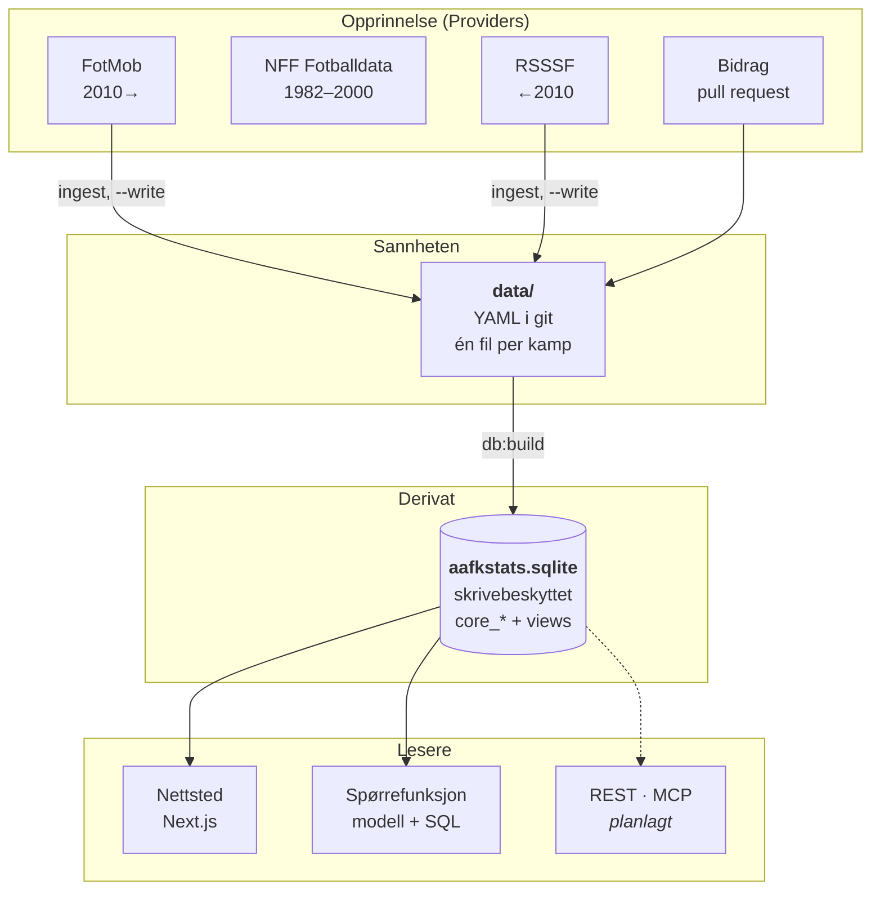
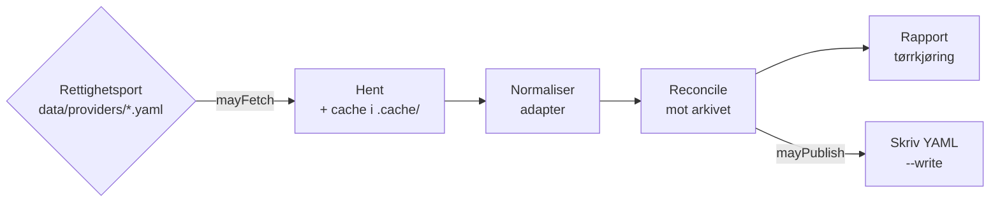

# Arkitektur

Hvordan AaFK-arkivet henger sammen, og hvorfor delene er som de er. Dokumentet er skrevet
for den som skal endre noe: hver avgjørelse står med alternativet som ble valgt bort.

- [Helhetsbildet](#helhetsbildet)
- [Lag for lag](#lag-for-lag)
- [Byggesteget](#byggesteget)
- [Datasettet som kontrakt](#datasettet-som-kontrakt)
- [Spørrefunksjonen og grensene rundt den](#spørrefunksjonen-og-grensene-rundt-den)
- [Innhøstingen](#innhøstingen)
- [Nettstedet](#nettstedet)
- [Testing og CI](#testing-og-ci)
- [Utrulling](#utrulling)
- [Ting som er bevisst utelatt](#ting-som-er-bevisst-utelatt)

## Helhetsbildet



To setninger bærer resten:

**Git er sannheten.** Arkivfilen kan når som helst slettes og bygges opp igjen fra
YAML-filene. Ingen opplysning finnes bare i databasen. Det er dét som gjør arkivet fritt: alt
kan klones, forkes og rettes, og hver rettelse har en historikk med begrunnelse.

**Databasen er et byggetidsderivat.** Den bygges ved hver utrulling, legges ved i
funksjonsbunten, og åpnes skrivebeskyttet. Den er aldri en cache som kan bli utdatert, fordi
dataene bare endrer seg gjennom en merge — og hver merge utløser en ny utrulling.

### Hvorfor ikke en databasetjeneste

Det opprinnelige utkastet var Neon Postgres. Det ble byttet ut, og bytteforholdet er verdt å
kjenne:

| | SQLite ved bygging | Postgres som tjeneste |
|---|---|---|
| Ferskhet | Per definisjon fersk: bygges av samme commit som koden | Fersk, men krever migrasjoner i takt med koden |
| Drift | Ingenting å drifte | Tjeneste, backup, tilkoblingsgrenser, kaldstart |
| Tester | Bygger sin egen fil i `beforeAll`, kjører likt overalt | Krever tjeneste, eller tester som «hoppes over» |
| Skrivetilstand | Finnes ikke | Naturlig sted for tellere og bruksmåling |
| Kostnad | Null | Løpende |

Den eneste reelle kostnaden er at skrivetilstand må bo et annet sted. Det gjelder to ting:
rate-limiting og bruksmåling. Begge hører hjemme foran applikasjonen uansett — Vercel Firewall
teller på kanten, og kostnadstaket ligger hos modelleverandøren. Se
[`apps/web/lib/rate-limit.ts`](../apps/web/lib/rate-limit.ts) for hvordan det henger sammen,
og hva reservelaget i minnet faktisk er verdt.

Hele arkivet — 1 351 kamper — bygges lokalt til én liten SQLite-fil. Byggetid og filstørrelse
varierer med maskin og SQLite-versjon og oppgis derfor ikke som faste arkivfakta.

## Lag for lag

| Pakke | Ansvar | Avhenger av |
|---|---|---|
| [`@aafkstats/schema`](../packages/schema/README.md) | Datamodellen som Zod-skjema, lasting og validering av arkivet, avledning til AaFK-perspektiv | — |
| [`@aafkstats/db`](../packages/db/README.md) | SQLite-skjemaet, byggesteget, og guardrailen rundt SQL utenfra | `schema` |
| [`@aafkstats/ingest`](../packages/ingest/README.md) | Kildeadaptere, cache, normalisering, rettighetsport og reconcile til YAML | `schema` |
| [`@aafkstats/query`](../packages/query/README.md) | Datasettdokumentasjonen, verktøydefinisjonene og systemprompten | `db`, `schema` |
| [`@aafkstats/web`](../apps/web/README.md) | Portalen, `/api/chat`, `/api/search`, `/data` | alle |

Retningen er enveis: `schema` vet ingenting om databasen, `db` vet ingenting om chatten, og
`ingest` vet ingenting om nettstedet. Den eneste veien data går inn i arkivet er YAML-filer,
og den eneste veien de kommer ut er de dokumenterte viewene.

## Byggesteget

[`packages/db/src/build.ts`](../packages/db/src/build.ts) gjør fire ting, i denne rekkefølgen:

1. **Laster og validerer.** `loadArchive()` leser hver YAML-fil mot Zod-skjemaet og samler
   feil i stedet for å kaste, slik at én ødelagt fil ikke skjuler de andre.
   `crossValidate()` legger til kontrollene som først er mulige når hele arkivet er lest:
   referanseintegritet, duplikate ID-er, og kamper som ser ut til å være lagt inn to ganger
   under ulike slugs.
2. **Bygger fra bunnen.** Filen skrives på nytt hver gang, aldri oppdateres inkrementelt.
   Resultatet avhenger da bare av innholdet i `data/`: to bygg av samme commit gir samme fil,
   og en slettet YAML-fil forsvinner faktisk.
3. **Løser opp det som kan løses én gang.** Tre ting regnes ut her i stedet for per spørring:
   - **AaFK-perspektivet** (`toAafkPerspective()` i `packages/schema`) — `is_home`,
     `opponent`, `aafk_score`, `goal_difference`, `result`.
   - **Tidsavhengige navn** (`nameAt()`) — konkurransens, motstanderens og stadionets navn
     slik de var på kampdatoen.
   - **Fullstendighet** — `completeness` og `missing_fields`, så det er søkbart hvor arkivet
     er tynt.

   I Postgres-utkastet var navneoppslaget en SQL-funksjon som kjørte per rad per spørring.
   Navnet for en gitt kampdato kan aldri endre seg, så oppslaget hører hjemme i byggesteget.
   Enklere, og raskere.
4. **`ANALYZE` og `VACUUM`.** Filen pakkes tett, og spørreplanleggeren får statistikk.

Avledningen ligger i `packages/schema`, ikke i SQL, fordi den samme funksjonen brukes av
testene og av visningslaget. Én implementasjon kan ikke bli uenig med seg selv.

## Datasettet som kontrakt

SQLite har ingen schemas, så skillet mellom internt og publisert uttrykkes med navn:

- **`core_*`** er interne tabeller. Rådata, alle kolonner, ingen garantier.
- **Viewene uten prefiks** — `matches`, `match_stats`, `seasons`, `opponents`, `match_events`, `sources` og
  FTS-tabellen `reports` — er den offentlige kontrakten.

### Proveniens: Providers vs Sources

Arkivet skiller strengt mellom hvor data kommer fra digitalt (Provider) og hvilket historisk dokument det opprinnelig stammer fra (Source).

- **Provider**: Dataleverandøren (f.eks. Fotball.no, Wikipedia, RSSSF, eller AaFK Historisk Arkiv). Spores med `providerId` i YAML og eksponeres som `providers`-array i viewene.
- **Source**: Det faktiske historiske dokumentet (f.eks. "AaFK 50 år", "AaFK Medlemsblad nr. 4 1958"). Lagres i `core_sources` (tidligere publikasjoner) og eksponeres i `sources`-viewet. Gjentakende utgivelser samles under en kilde med `sourceType: series`; hver utgave peker eksplisitt på serien med `parentSourceId`, og valideringen krever at denne forelderen finnes og faktisk er en serie.
- **SourceRef**: Koblingen mellom et spesifikt datapunkt (som en match) og en `source`, med mulighet for å peke på nøyaktig sidetall eller felt (`sourceRef`). Fordi en kilde som regel er brukt til ett felt og ikke til hele kampen, sier kildesiden «Kamper der kilden er brukt» — ikke «dokumenterte kamper», som ville lovet mer enn referansen dekker.

Bibliografien på en `source` — `urn`, `author` og `description` — er valgfri. `urn` er den stabile identifikatoren, som regel Nasjonalbibliotekets; `accessUrl` er bare en adresse, og adresser endrer seg. Feltene er dokumentert i [`docs/DATAMODELL.md`](DATAMODELL.md#historisk-kilde).

Personroller er egne, kildeførte relasjoner i personfila og bygges til
`core_person_roles`, `person_roles` og `people`. Det lar `/personer` samle kampaktivitet
og organisasjonsverv på samme identitet, mens `/organisasjon` kan gruppere de samme
rollene som styrer og tidslinjer uten å kopiere data. Sesonger og kamper peker direkte
på historiske publikasjoner med `sourceRef`; kildesiden viser koblingen tilbake.

Masseuttrekket fra NB ligger i et eget kandidatlag. `data/extractions/` valideres av
`publicationExtraction`, bygges til `core_publication_extractions` og
`core_fact_candidates`, og eksponeres som `publication_extractions` og
`fact_candidates`. Rå ALTO ligger bare i ignorert cache. Kandidatlaget kan derfor
søkes og prioriteres uten at OCR-prosa blir en del av arkivet eller at usikre treff
blir framstilt som kanoniske fakta. Se [`NB_MASSEUTTREKK.md`](NB_MASSEUTTREKK.md).

Visningsnavnet på en leverandør leses fra `core_providers.name`, aldri fra en streng i UI-koden. Ellers får kildesiden og kampsiden hver sitt navn på samme leverandør.

Spørrefunksjonen ser bare viewene. Et senere REST-API og en MCP-server skal bruke den samme
kontrakten. Legger du til en kolonne i `core_matches` uten å eksponere den i et view, har du
lagt til rådata; legger du den til i et view, har du utvidet kontrakten, og da skal den også
dokumenteres i [`packages/query/src/dataset.ts`](../packages/query/src/dataset.ts).

### `matches`-viewet

Den viktigste avgjørelsen i hele datasettet. I stedet for hjemme/borte-kolonner der man må
vite hvilken side AaFK spilte på, er hver kamp flatet ut til «oss» og «motstander»:

```sql
SELECT date, opponent, aafk_score, opponent_score, url
FROM matches
WHERE is_home = 1 AND result = 'T' AND goal_difference <= -6
ORDER BY date DESC LIMIT 1;
```

Uten `is_home`/`opponent`/`aafk_score` måtte enhver spørring begynt med et `CASE` over
hjemmelag og bortelag. Det er nettopp den typen resonnement en språkmodell bommer på i
kanttilfellene, og som et menneske skriver feil i en travel time.

Kampstatistikken følger samme regel: `aafk_xg`, `aafk_shots` og de øvrige
`aafk_*`-kolonnene betyr alltid AaFKs tall. `match_stats` gir i tillegg to rader per kamp,
én for hver side, når en analyse passer bedre i langt format. Avledede mål som
xG-differanse lagres ikke; de regnes ut i spørringen.

Invarianten som gjør det mulig — nøyaktig én av sidene i en kamp er `aalesunds-fk` —
håndheves av skjemaet, ikke av konvensjon.

### Én sannhet, to lesere

[`packages/query/src/dataset.ts`](../packages/query/src/dataset.ts) er dokumentasjonen av
datasettet. Den rendres for mennesker på [`/data`](https://aafkstats.vercel.app/data), og
den er samtidig andre halvdel av chattens systemprompt. Det finnes altså ingen skjult
beskrivelse modellen har og brukeren ikke har.

`packages/query/test/dataset.test.ts` åpner den faktiske arkivfilen og sammenligner: alle
dokumenterte views må finnes, alle dokumenterte kolonner må finnes, og hver eksempelspørring
må kjøre. Dokumentasjon som ikke stemmer er verre enn ingen dokumentasjon, særlig når en
modell handler på den.

## Spørrefunksjonen og grensene rundt den

Chatten kan skrive og kjøre egne SELECT-spørringer. Det er dét som gjør at den kan svare på
spørsmål ingen har laget et ferdig oppslag for. Seks lag holder det trygt:

| Lag | Håndheves av | Hva det stopper |
|---|---|---|
| Filen åpnes med `readOnly` | **SQLite** | All skriving, uansett hvor den kommer fra |
| Egen prosess, `SIGKILL` ved timeout | **operativsystemet** | Spørringer som ikke lar seg avbryte |
| Miljø uten hemmeligheter, tak på haugen | **operativsystemet** | Lekkasje av nøkler, og minnebruk som velter instansen |
| Én setning, kun SELECT/WITH, ingen `core_*`, `sqlite_*` eller `pragma_*` | koden | Setningsstabling, tilgang til rådata og til skjemaet |
| Radtak på 200, og 256 kB uansett hvor mange rader | koden | Svar som sprenger kontekstvinduet, og regningen |
| Logging av hver spørring | koden | Ingenting — det er observasjon |

**De tre første er sikkerhet**, og de holder uansett hva lagene over overser.

### Hvorfor en egen prosess

SQLite har ingen `statement_timeout`. En spørring som blokkerer i motoren lar seg ikke
avbryte fra JavaScript: `DatabaseSync`-kallet er synkront og holder tråden så lenge det tar.
En `Worker` hjelper ikke, for `terminate()` venter på at det pågående kallet returnerer.

Derfor kjører hver spørring i en egen Node-prosess som avlives utenfra med `SIGKILL`. Det
koster rundt 45 ms per spørring, og det er den eneste måten grensen faktisk holder. Se
[`packages/db/src/safe-sql.ts`](../packages/db/src/safe-sql.ts).

### Tekstanalysen: to utgaver av samme spørring

Mesteparten av tekstkontrollen finnes for å gi modellen en forståelig feilmelding i stedet
for en rå motorfeil. `INSERT` stoppes uansett av `readOnly`; poenget med å avvise den i koden
er at modellen får vite *hvorfor* og kan formulere om.

**Navnekontrollen er unntaket.** Den er den eneste grensen mot `core_`-tabellene, for SQLite
har ingen roller og kan ikke gi leserett på viewene alene. Derfor leses spørringen i to
utgaver:

| Utgave | Brukes til | Hvorfor |
|---|---|---|
| `stripLiterals()` — strenger, siterte navn og kommentarer blankes ut | Setningsdeling og nøkkelord | `WHERE note = 'a;b'` er én setning, og `SELECT "drop"` er en kolonne |
| `revealIdentifiers()` — siterte identifikatorer pakkes ut, strenger blankes fortsatt | Navnene | SQLite godtar `"core_matches"`, `[core_matches]` og `` `core_matches` `` som samme tabell |

Leser kontrollen bare den første utgaven, gjemmer et par anførselstegn navnet for filteret og
viser det til motoren. Filtrene dekker derfor navnerom og ikke lister: hele `sqlite_`-rommet
utenom `sqlite_version()`, og `pragma\w*` — PRAGMA finnes også som tabellverdifunksjon, og
`pragma_database_list` røper hvor arkivfilen ligger på disk.

Byte-taket hører til samme resonnement fra motsatt kant: 200 rader kan være 200 byte eller
200 megabyte, og resultatet går rett inn i modellens kontekst. Taket er like mye en
kostnadsgrense som en minnegrense.

[`packages/db/test/safe-sql.integration.test.ts`](../packages/db/test/safe-sql.integration.test.ts)
prøver å bryte hvert lag mot en ekte arkivfil, inkludert direkte skriveforsøk utenom koden.

### Grensene før spørringen: hva ett kall får koste

SQL-grensene beskytter arkivfilen. Grensene i
[`apps/web/lib/chat-request.ts`](../apps/web/lib/chat-request.ts) beskytter regningen, og de
kjører før modellen kalles:

| Grense | Verdi | Hvorfor |
|---|---|---|
| Spørsmålets lengde | 1 000 tegn | Ett spørsmål, ikke et dokument |
| Historikk | 6 meldinger, 4 000 tegn per melding, 12 000 til sammen | Klienten sender den; taket er på inn-tokens |
| Kroppens størrelse | 64 kB, lest med tak | Uten dette er grensene over rådgivende — alt er lest og parset før første kontroll |
| Rolle i historikken | bare `user` og `assistant` | Historikken kommer fra klienten, ikke fra oss |

Chatten avviser også POST-kall fra andre nettsteder. Det er ikke CSRF i vanlig forstand — det
finnes ingen innlogging å misbruke — men `Content-Type: text/plain` gjør en POST til en
«simple request» uten forhåndssjekk, og da kan en hvilken som helst side sette sine besøkendes
nettlesere til å tømme API-budsjettet. Kall uten `Origin` slipper gjennom; de stoppes av
fartsgrensen i stedet.

### Prompt injection

Kampreferat og notater i datasettet er tekst skrevet av bidragsytere. Systemprompten sier
uttrykkelig at slikt innhold er data å referere til, aldri instruksjoner. Skulle et forsøk
komme gjennom, er det fortsatt lagene over som avgjør hva som faktisk kan skje: en modell som
lar seg overtale kan i verste fall skrive en rar SELECT.

## Innhøstingen

Regelen er at **en adapter ikke er en crawler**. Hver kjøring navngir kilde, konkurranse og
sesong eksplisitt. Det finnes ingen kommando som oppdager alle sesonger og starter en full
backfill.

Flyten er den samme for begge kildene:



Rettighetsporten ([`packages/ingest/src/policy.ts`](../packages/ingest/src/policy.ts)) er to
spørsmål, ikke ett:

- `automatedAccess` — kan vi hente? Kontrolleres før nettverkskallet.
- `publicRedistribution` — kan vi publisere videre? Kontrolleres før `--write`.

`unknown` regnes aldri som et ja, og det finnes ikke noe flagg som slår av porten. Tørrkjøring
er alltid tillatt: å undersøke hva en kilde inneholder er nettopp det man må gjøre for å kunne
be om tillatelse til å bruke den.

`reconcile()` lager en deterministisk skriveplan. Tvetydige treff blir issues og skrives ikke.
En kamp en annen kilde allerede eier, oppdateres ikke stille — enten stopper kjøringen, eller
kampen hoppes over og telles med `--skip-existing`. Hver kamp har nøyaktig én kilde; et
observasjonslag som kan slå sammen flere kilder per felt er ikke bygget ennå, og en stille
sammenslåing ville skjult hvem som mente hva.

## Nettstedet

Next.js 15 med App Router. Sidene leser arkivfilen direkte gjennom `@aafkstats/db`, og
innholdet er låst mellom to utrullinger — så hver side med et innhold som ikke kan endre seg
forhåndsgenereres. Kamp-, sesong-, motstander- og kildesidene har hver sin
`generateStaticParams()`, som leser ID-lista fra arkivet: nye kamper og nye kilder kommer med
av seg selv ved neste bygg. Det er drøyt 1 600 sider i dag, bygget på under et minutt — og
tallet står med vilje omtrentlig her, siden hver innhøsting flytter det.

Bare rutene under `/api` rendres ved forespørsel, og det er de eneste som må: de gjør noe
annet enn å lese arkivet.

Tre ruter gjør noe mer enn å lese:

- **`/api/search`** — direktesøk mens brukeren skriver. Ren SQL mot arkivfilen, ingen modell
  involvert. Se [`apps/web/lib/search.ts`](../apps/web/lib/search.ts).
- **`/api/chat`** — spørrefunksjonen. Streamer SSE, kjører verktøyløkka mot modellen, og
  logger hver spørring til Vercel Logs uten IP. Hvilken modell, og hos hvem, avgjøres av
  hvilken API-nøkkel som er satt — se
  [`apps/web/lib/chat-model.ts`](../apps/web/lib/chat-model.ts). Verktøydefinisjonene er de
  samme uansett; det er bare selve kallet som er to. En kort samtale lever bare i
  nettleserkomponenten. Modellen kan registrere ett strukturert oppfølgingsforslag, som ruta
  sender som en egen SSE-hendelse først etter et vellykket hovedsvar.
- **`/api/contributions`** — tar imot minner og observasjoner uten innlogging og oppretter
  en sak i en separat GitHub-innboks. Den skriver aldri i arkivet. Datafeil, manglende
  kamper og kildetips går til egne issue-maler i hovedrepoet i stedet.

Arkivfilen leses av serverkoden ved kjøring, og må derfor spores inn i funksjonsbunten. Det
er `outputFileTracingIncludes` i [`next.config.mjs`](../apps/web/next.config.mjs) — sammen med
to andre bundler-tilpasninger som er kommentert der de står, fordi `node:sqlite` fortsatt er
eksperimentell i Node 22 og ikke oppfører seg som en vanlig innebygd modul.

Samme fil setter svarhodene: en stram CSP (`default-src 'self'`, ingen eksterne verter i det
hele tatt), `nosniff`, `frame-ancestors 'none'`, `Referrer-Policy` og HSTS. Nettstedet henter
ingenting utenfra, så policyen kan være så stram som den er. `'unsafe-inline'` på `script-src`
er Next sitt hydreringsdata-unntak, og det står forklart der.

## Testing og CI

204 tester, ingen tjeneste. Testene som trenger en database bygger sin egen arkivfil fra
`fixtures/data` i `beforeAll` — det tar millisekunder, og gjør at alt kjører likt lokalt og i
CI. Det finnes ingen tester som «hoppes over uten database».

[`fixtures/data`](../fixtures/README.md) er et konstruert arkiv, ikke et utdrag av det ekte.
Resultatene der er laget for å gi deterministiske svar, blant annet ett hjemmetap med seks
måls margin — testspørsmålet portalen skal klare. Ekte kamper ville endret seg når arkivet
vokser, og da måler testene noe annet enn de gjorde i går.

CI kjører, i rekkefølge: valider arkivet, valider fixture-arkivet, typesjekk, lint, tester, og
til slutt et fullt bygg av nettstedet med fixture-data. Byggesteget bruker fixtures med vilje —
med et tomt `data/` ville det vært grønt uten å ha rendret en eneste kamp. Jobben kjører med
`permissions: contents: read`, så et kompromittert ledd i pnpm-treet ikke har et token som kan
skrive tilbake til repoet.

## Utrulling

Vercel, med bygg per merge til `main`. Byggekommandoen bygger arkivfilen først og deretter
nettstedet, så en utrulling alltid inneholder data fra nøyaktig den commiten.

Miljøvariabler står i [`.env.example`](../.env.example). Bare én API-nøkkel er påkrevd for
full funksjonalitet — `ANTHROPIC_API_KEY` eller `OPENAI_API_KEY` — og uten begge svarer
`/api/chat` med 503, mens resten av nettstedet virker som normalt. `AAFK_CHAT_PROVIDER`
avgjør hvem som svarer når begge er satt, `AAFK_CHAT_MODEL` hvilken modell.

## Ting som er bevisst utelatt

- **Ingen ORM.** Skjemaet er én SQL-fil med kommentarer, lettere å lese enn en modellfil, og
  spørringene er få og håndskrevne.
- **Ingen migrasjoner.** Databasen bygges fra bunnen hver gang. En migrasjon er noe man
  trenger når tilstanden ikke kan gjenskapes.
- **Ingen brukerkontoer.** Arkivet er offentlig, og bidrag går gjennom pull request.
- **Ingen API som skriver i arkivet.** Minneskjemaet oppretter bare en innboks-sak. Den
  eneste veien inn i selve arkivet er en PR-diff et menneske har sett.
- **Ingen egen loggtjeneste.** Strukturert JSON til stdout dekker volum, SQL-form, modell,
  tokenbruk og kjøretid. Spørsmålstekst, IP-adresse og SQL-strenger logges ikke.

Det som gjenstår å bygge, i rekkefølge, står i
[Plan fra pilot til arkiv](PLAN_FRA_PILOT_TIL_ARKIV.md).
