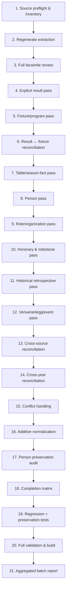

# Runbook: Historisk kildeinnhøsting og visuell primærkildekontroll

Dette dokumentet er den **autoritative produksjonsstandarden** for manuell og semi-maskinell innhøsting av historiske trykte publikasjoner i AaFK-arkivet.

Standarden er kildeagnostisk og gjelder for alle sidebaserte historiske kilder:
- Medlemsblad og klubbaviser
- Årbøker (f.eks. NFFs årbøker, kretsårbøker)
- Jubileumsbøker og festskrift (f.eks. 25-, 40-, 50- og 100-årsbøker)
- Årsrapporter og beretninger (f.eks. SFK årsrapporter, AaFK årsberetninger)
- Andre trykte publikasjoner, hefter og turneringsprogram

---

## 1. Autoritetsrekkefølge

Ved motstrid mellom dokumenter, schema eller instrukser gjelder følgende autoritetsrekkefølge strengt:

1. **`packages/schema/` og `docs/DATAMODELL.md`**
   - Autoritativ kilde for:
     - Gyldige YAML-felter og attributter
     - Datatyper og valideringsregler
     - Filstier og katalogstruktur
     - Zod-skjemaer og databasestruktur
2. **`docs/HISTORISK_KILDEINNHOSTING_RUNBOOK.md`** (dette dokumentet)
   - Autoritativ kilde for:
     - Redaksjonell arbeidsflyt og innhøstingsprosess
     - Kildekritiske prinsipper og kildehierarki
     - Proveniens, source-results og kanonisering
     - Terminliste- og resultat-reconciliation
     - Additivitetsgaranti og preservation
     - Completion-metrikker og Definition of Done
3. **Kildespesifikk profil** (f.eks. [`docs/MEDLEMSBLAD_INNHOSTING.md`](MEDLEMSBLAD_INNHOSTING.md))
   - Autoritativ kilde for særtrekk, heftegranularitet og spesialregler for den aktuelle kildetypen.
4. **Oppgaveprompt / brukerinstruks**
   - Definerer oppgavens omfang (scope), årstall, sourceId-er og ønsket leveranse. Prompten skal normalt ikke repetere eller overstyre runbookens krav.

> [!IMPORTANT]
> **Schema vinner alltid over tekst:** Dersom runbooken skulle beskrive et felt eller en filsti som avviker fra gjeldende Zod-schema i `packages/schema/`, skal schemaet alltid følges, og runbooken oppdateres.

---

## 2. Normativt språk

I denne runbooken gjelder følgende nøkkelord strengt:
- **MUST / SKAL:** Absolutt krav. Brudd er en merge-blocker.
- **MUST NOT / SKAL IKKE:** Forbudt praksis. Fører til data- eller arkitekturdrift og avvises i review.
- **SHOULD / BØR:** Sterkt anbefalt standardmetode. Avvik krever eksplisitt begrunnelse i reviewrapporten.
- **MAY / KAN:** Valgfri forbedring eller utvidelse når kildematerialet gir grunnlag for det.

---

## 3. Kildehierarki og kildekritikk

### Faksimile er primær representasjon

Arkivet bygger på det fysiske, trykte kildematerialet slik det foreligger i høyoppløselige faksimiler (skann).

OCR og ALTO-data fra digitale bibliotek (f.eks. Nasjonalbiblioteket) er utelukkende:
- søkehjelpemidler
- kandidatgeneratorer
- navigasjonsverktøy
- grunnlag for automatisert forhåndsanalyse

OCR/ALTO **SKAL IKKE** overstyre visuell kontroll av faksimilen.

Prioritetsregelen er:
```
Faksimile (visuelt kontrollert originaltrykk)
  > Korrekt manuelt lest tekst
    > Maskinell OCR / ALTO-tekst
      > Adapter- eller resolver-tolkning
```

> [!IMPORTANT]
> **Samtidighet er ikke ufeilbarlighet:** At en samtidig primærkilde hevder noe, betyr ikke automatisk at påstanden er historisk sannhet. Kildepåstanden skal bevares nøyaktig slik den er trykt i `data/source-results/<sourceId>.yaml`, mens kanoniske data fastsettes etter kildekritisk vurdering og eventuell avstemming mot andre kilder.

---

## 4. Hvorfor disse invariantene finnes (Lessons Ledger)

Disse kjernereglene er etablert direkte på grunnlag av erfaringer og avdekkede feilmodi i tidligere innhøstings-PR-er (#151–#156):

| Læring & Feilmodus | Opphav | Invariant i runbooken |
|---|---|---|
| Terminliste er planlagt oppsett, ikke faktisk kampdato | PR #153 | Fixture må reconciles mot separat evidence på spilt kamp før dato kanoniseres |
| Eksisterende personhistorikk forsvinner ved overskriving | PR #155 | Streng additivitetsgaranti, manuell preservation audit og obligatoriske regresjonstester |
| Valg sent på året gjelder som regel neste arbeidsår | PR #156 | Valgdato != funksjonsår/snapshot-år. Arbeidsårskontroll er obligatorisk |
| Retrospektivt jubileumsstoff blir liggende bare i review | PR #156 | Sikre historiske kildepåstander normaliseres i `data/source-results/` under korrekt historisk sesong |
| Identisk opptrykk (reprint) ser ut som to uavhengige kilder | PR #156 | Reprints merkes eksplisitt med `duplicate_publication` / `reprint` |
| Sesongtotal og eksplisitte enkeltresultater ble blandet | PR #156 | Én metrikk har én entydig definisjon; sesongtotaler brukes som kontrollsum |
| Én gjennomgått sourceId er ikke nødvendigvis hele årgangen | Videre analyse | Obligatorisk Source Inventory før review starter |

---

## 5. Standard 21-trinns arbeidsflyt

Innhøsting av en publikasjon eller årgang følger en fast produksjonsløype i 21 steg:



### Steg 1: Source preflight & Source Inventory
- **Input:** Kildedefinisjoner i `data/sources/*.yaml` og provider-metadata.
- **Leter etter:** Samtlige kilder i det definerte årsscopet (`parentSourceId`, `year`, `volume`, `issue`, `title`, `sourceId`, `urn`, extraction status). Sjekk skannummer vs. trykt sidetall, ALTO-tilgang og eventuelle reprints/særnumre.
- **Tillatte sluttilstander:** Komplett Source Inventory-tabell i reviewrapporten der samtlige identifiserte sourceId-er har en eksplisitt status (`reviewed`, `duplicate/reprint`, `out_of_scope`, `unavailable`).
- **Typiske feil:** Å reviewe ett hefte og tro at hele årgangen er ferdig; å forveksle skannummer med trykt sidetall.
- **Definition of Done:** Source Inventory er utfylt og verifisert mot kildekatalogen.

### Steg 2: Regenerate extraction (arbeidskø)
- **Input:** Publikasjonens råtekst/ALTO og `nb-extract`-pipeline.
- **Leter etter:** Maskinelle kandidater for kamper, personer, roller og lagoppstillinger.
- **Tillatte sluttilstander:** `data/extractions/<sourceId>.yaml` er oppdatert som maskinell arbeidskø.
- **Typiske feil:** Å tro at extraction-filen er et ferdig datasett fremfor en kandidatliste.
- **Definition of Done:** Uttrekk er kjørt og logget, klar til visuell verifisering.

### Steg 3: Full facsimile review
- **Input:** Samtlige sider i publikasjonen (faksimilevisning / høyoppløselig PDF).
- **Leter etter:** All sportslig og organisatorisk informasjon på hver enkelt side.
- **Tillatte sluttilstander:** 100 % av sidene er visuelt kontrollert og logget i kontrollmatrisen.
- **Typiske feil:** Å bare se på sider som har maskinelle kandidater.
- **Definition of Done:** Reviewloggen inneholder en komplett side-for-side-tabell (`X / X sider visuelt kontrollert`).

### Steg 4: Explicit result pass
- **Input:** Spaltemeldinger, kampreferater og tabelloppsett.
- **Leter etter:** Eksplisitt dokumenterte samtidige kampresultater for A-laget (motstander, score, dato, bane, turnering).
- **Tillatte sluttilstander:** Hvert resultat er registrert som en kildepåstand i `data/source-results/<sourceId>.yaml` under `seasons[].results[]`.
- **Typiske feil:** Å opprette en kanonisk kampfil direkte før kildepåstanden er sikret; å gjette ukjent dato.
- **Definition of Done:** Samtlige trykte samtidige resultater er registrert i source-results med trykt sidetall.

### Steg 5: Fixture/program pass
- **Input:** Terminlister, sesongprogrammer og kampannonser.
- **Leter etter:** Planlagte kamper, motstandere, rekkefølge, runder og planlagte datoer.
- **Tillatte sluttilstander:** Terminlister er registrert som `fixture_list`-objekter og vurdert mot resultatene.
- **Typiske feil:** Å anta at en terminliste beviser at kampen ble spilt på planlagt dato.
- **Definition of Done:** Alle terminlister er ekstrahert med eksplisitt angivelse av planlagte felt.

### Steg 6: Result ↔ fixture reconciliation
- **Input:** Dokumenterte resultater (steg 4) og terminlister (steg 5).
- **Leter etter:** Samsvar mellom planlagt oppsett og faktisk spilt kamp (motstander, hjemme/borte, rekkefølge, sesonghalvdel).
- **Tillatte sluttilstander:** Entydig kobling mellom planlagt termin og spilt kamp basert på de 9 sjekkpunktene i kapittel 8.
- **Typiske feil:** Å overskrive faktisk spilledato med en planlagt dato fra våren; å koble feil kamp ved dobbeltoppgjør.
- **Definition of Done:** Reconciliation-seksjonen i reviewrapporten dokumenterer koblingen for hver enkelt kamp.

### Steg 7: Table/season-fact pass
- **Input:** Trykte tabeller, sesongfasiter, målforskjeller og kildearitmetikk.
- **Leter etter:** Totaler for A-laget (kamper, V-U-T, målforskjell, poeng).
- **Tillatte sluttilstander:** Sesongtotaler er registrert som kontrollsum (checksum). Trykte regnefeil i kilden er bevart og kommentert.
- **Typiske feil:** Å bruke sesongsummer til å regne ut ukjente enkeltkamper matematisk; å korrigere trykkfeil i stillhet.
- **Definition of Done:** Sesongsummen er avstemt mot antall eksplisitte kamper, og eventuelle kildearitmetiske avvik er notert.

### Steg 8: Person pass
- **Input:** Løpende tekst, portretter, omtaler og lister.
- **Leter etter:** Spillere, ledere, tillitsvalgte, æresmedlemmer og andre sentrale klubbpersoner.
- **Tillatte sluttilstander:** Personene er identifisert mot eksisterende personregister i `data/people/*.yaml` eller vurdert for opprettelse.
- **Typiske feil:** Å opprette duplikatpersoner ved navnevarianter; å overse ukjente nøkkelpersoner.
- **Definition of Done:** Alle personfunn har en formell disposisjon (`person_created`, `person_enriched`, `identity_uncertain` etc.).

### Steg 9: Role/organization pass
- **Input:** Årsmøtereferater, styrelister, komitélister og treneromtaler.
- **Leter etter:** Formenn, styremedlemmer, oppmenn, trenere, banekomité, dameavdeling og krets/forbundsverv.
- **Tillatte sluttilstander:** Roller er registrert i personfilenes `roles`-array og/eller i årlige organisasjonssnapshots (`data/organization/snapshots/<dato/år>-<organizationId>.yaml`).
- **Typiske feil:** Å forskyve valgår til feil arbeidsår; å modernisere historisk terminologi (f.eks. endre oppmann til trener).
- **Definition of Done:** Hovedstyre og nøkkelroller er strukturert med kildehenvisning og korrekt funksjonsår.

### Steg 10: Honorary & milestone pass
- **Input:** Jubileumsartikler, tildelinger, merkeoversikter og hedersomtale.
- **Leter etter:** Gullmerker, hedersbevisninger (f.eks. Kruset), æresmedlemskap, 100/200-kampers spillemerker, jubileer.
- **Tillatte sluttilstander:** Hedersbevisninger lagres som strukturerte personroller med `category: honorary` når dette passer modellen. Øvrige milepæler lagres som roller, observasjoner eller kildeomtaler.
- **Typiske feil:** Å dikte opp egne `honors`-arrays i YAML som ikke finnes i schema.
- **Definition of Done:** Alle dokumenterte utmerkelser er lagt inn i tråd med gjeldende schema.

### Steg 11: Historical retrospective pass
- **Input:** Jubileumsartikler, historiske tilbakeblikk og memoarer i publikasjonen.
- **Leter etter:** Dokumentasjon av kamper, personer og hendelser fra tidligere tiår.
- **Tillatte sluttilstander:** Kildepåstander er ført i `data/source-results/<sourceId>.yaml` under korrekt historisk `seasons[].year`, aldri publikasjonsåret.
- **Typiske feil:** Å lagre et cupresultat fra 1933 under 1954 fordi det sto i et 1954-hefte.
- **Definition of Done:** Retrospektive fakta er reconciliert mot eksisterende historikk for det aktuelle året.

### Steg 12: Venue/anlegg/event pass
- **Input:** Anleggsrapporter, dugnadsnotiser, innvielsesartikler og festreferater.
- **Leter etter:** Banebygging (f.eks. Nørvebanen, Aksla, Kråmyra), klubbhus, banetiltak, jubileumsfester.
- **Tillatte sluttilstander:** Viktige milepæler er strukturert som `data/observations/<år>-<slug>.yaml` eller kildeberiket på arenaen.
- **Typiske feil:** Å overse store klubbhistoriske hendelser som ikke er rene kamper eller personroller.
- **Definition of Done:** Observasjoner er opprettet for dokumenterte milepæler med korrekt dato og kildereferanse.

### Steg 13: Cross-source reconciliation
- **Input:** Samtidige kilder (f.eks. medlemsblad vs. SFK årsrapport vs. dagsaviser vs. NFF årbok).
- **Leter etter:** Samstemmighet eller uenighet om datoer, resultater, målscorere og verv.
- **Tillatte sluttilstander:** Samstemte fakta styrker kanoniske data; motstridende fakta dokumenteres som konflikter.
- **Typiske feil:** Å slette en kildepåstand fordi en annen kilde hevder noe annet.
- **Definition of Done:** Forskjeller mellom kilder er eksplisitt notert og håndtert etter konfliktreglene.

### Steg 14: Cross-year reconciliation (ingen interpolasjon)
- **Input:** Tilstøtende årganger og publiserte flerårsoversikter.
- **Leter etter:** Kontinuitet i roller, kamprekker, karrierestatistikk og turneringsforløp (høst/vår-sesonger).
- **Tillatte sluttilstander:** Overganger mellom sesonghalvdeler og flerårige styreperioder henger logisk sammen.
- **Typiske feil:** Å automatisk fylle hull: Fravær av kilde for ett år er **IKKE** positiv dokumentasjon på kontinuitet. Hvis Hans er formann i 1954 og 1956, men 1955 mangler kilde, skal ikke perioden settes til `1954–1956` uten kildedekning.
- **Definition of Done:** Årsoverganger er avstemt mot forrige og neste batch uten udokumentert interpolasjon.

### Steg 15: Conflict handling
- **Input:** Uenigheter mellom kilder identifisert i steg 13 og 14.
- **Leter etter:** Forskjeller i fødselsdatoer, resultater, verv og tildelingsår.
- **Tillatte sluttilstander:** Konflikter er registrert i `conflicts`-blokken på personen med gjeldende schema-felter (`field`, `values`, `resolved`, `chosen`, `chosenProviderId`, `decision`, `decidedAt`, `reason`, `locked`, `note`).
- **Typiske feil:** Å fjerne konfliktblokken for å "rydde opp".
- **Definition of Done:** Både uløste (`decision: unresolved`) og løste konflikter er bevart med full proveniens for alle involverte parter.

### Steg 16: Additive normalization
- **Input:** Alle nye funn og eksisterende YAML-filer i `data/`.
- **Leter etter:** Berikelse av eksisterende person-, kamp-, sesong- og organisasjonsfiler.
- **Tillatte sluttilstander:** Nye fakta legges til additivt uten at noen eksisterende felter går tapt.
- **Typiske feil:** Å overskrive en hel personfil med en minimal versjon som bare inneholder årets nye rolle.
- **Definition of Done:** Full diff viser utelukkende additive endringer og velbegrunnede korreksjoner.

### Steg 17: Person preservation audit
- **Input:** `pnpm data:historical-preservation` og `git diff data/people/`.
- **Leter etter:** Utilsiktet tap av roller, kilder, konflikter, navnevarianter (`names`), trenerperioder (`coachSpells`) eller metadata.
- **Tillatte sluttilstander:** Null uforklarlige slettinger (`pnpm data:historical-preservation` rapporterer 0 destructive changes).
- **Typiske feil:** Å stole på at en editor eller et script ikke har fjernet eldre blokker.
- **Definition of Done:** Både automatisert `pnpm data:historical-preservation` og manuell diff-audit bekrefter at all eksisterende historikk består.

### Steg 18: Completion matrix
- **Input:** Samtlige tall og funn fra batchen.
- **Leter etter:** Målbare metrikker for alle kategorier i innhøstingen.
- **Tillatte sluttilstander:** En fullstendig utfylt completion-matrise i reviewrapporten basert på standarddefinisjonene.
- **Typiske feil:** Å oppgi vage formuleringer ("mange personer funnet") i stedet for eksakte tall.
- **Definition of Done:** Matrisen er komplett med sammenlignbare tall for alle år i batchen.

### Steg 19: Regression + preservation tests
- **Input:** Sentinel-personer og sentrale kamper berørt av batchen.
- **Leter etter:** Verifisering av at både nye fakta finnes og at eksisterende historikk er uendret.
- **Tillatte sluttilstander:** Automatiserte regresjonstester i `packages/schema/test/` kjører grønt.
- **Krav:** Ved større historiske kildebatcher som endrer eksisterende personfiler **SKAL** det legges til preservation-regresjonstester.
- **Definition of Done:** Tester dekker nytt funn + eksisterende historikk og passerer i testsuiten.

### Steg 20: Full validation & build
- **Input:** Hele arkivet og byggekoden.
- **Leter etter:** Skjemavalidering, dataintegritet, duplikater, uavklarte motstandere, selvmotsigelser og typefeil.
- **Tillatte sluttilstander:** Alle sjekker og bygg i repoets valideringsstandard er kjørt; tekniske feil er 0, og alle rapporter er vurdert redaksjonelt.
- **Definition of Done:** Valideringsskriptene og bygg fullfører feilfritt.

### Steg 21: Aggregated batch report
- **Input:** Enkeltår-reviews og samlet completion-matrise.
- **Leter etter:** Helhetlig dokumentasjon av periodens sportslige, administrative og anleggsmessige utvikling.
- **Tillatte sluttilstander:** En samlet rapportfil i `docs/data/` klar for PR-review.
- **Definition of Done:** Batchrapporten er ferdigstilt og lenket i PR-beskrivelsen.

---

## 6. Dispositions-vokabular

For å sikre sporbarhet og stringens **SKAL** alle relevante funn klassifiseres med en eksplisitt disposisjon.

> [!WARNING]
> Statusen `reviewed` er et prosess-stadium i sidetabellen, **IKKE** en gyldig endelig disposisjon for et identifisert historisk funn.

### Disposisjoner for kamp og sportslige oppgjør

| Disposisjon | Betydning | Håndtering i arkivet |
|---|---|---|
| `source_result_created` | Nytt eksplisitt kampresultat funnet i kilden | Opprettes i `data/source-results/<sourceId>.yaml` under `seasons[].results[]` |
| `canonical_created` | Sikker kampidentitet etablert for første gang | Ny kampfil i `data/seasons/<år>/matches/` |
| `canonical_enriched` | Eksisterende kanonisk kamp tilført nye felt/kilde | Felt og kildehenvisning lagt til i kampfil |
| `fixture_only` | Bare planlagt terminlisteoppføring funnet | Registrert i kilde/review, ikke som spilt kamp |
| `outcome_only` | Kamp nevnt med utfall (f.eks. seier), men uten score | Bevares i review/disposition. Ikke opprett ugyldig source-result uten score |
| `result_without_date` | Konkret score dokumentert, men eksakt dato mangler | Lagres i `data/source-results/<sourceId>.yaml` når motstander og score er sikker |
| `date_without_result` | Spilledato dokumentert, men sluttresultat mangler | Bevares i review/disposition; opprettes ikke som played source-result |
| `already_documented` | Kampen er fullverdig dokumentert fra eldre primærkilde | Kildehenvisning legges til dersom relevant |
| `duplicate_publication` | Identisk opptrykk / reprint fra annen kilde | Merkes som reprint i source-results/review |
| `identity_uncertain` | Usikkerhet om motstander, år eller lag | Dokumenteres i review, ingen kanonisk kobling |
| `not_a_team` | Kampen gjelder internt oppgjør, oppvisning e.l. | Noteres i review, ikke kanonisk A-kamp |
| `no_structured_action` | Generell tekst/omtale uten nye strukturerbare fakta | Ingen endring i YAML |

### Disposisjoner for personer og roller

| Disposisjon | Betydning | Håndtering i arkivet |
|---|---|---|
| `person_created` | Ny person med verifisert virke i klubben | Ny fil i `data/people/<slug>.yaml` |
| `person_enriched` | Eksisterende person tilført nye fakta/kilder | Additiv oppdatering av eksisterende personfil |
| `role_created` | Nytt styre-, trener- eller komitéverv | Lagt til i personens `roles` og ev. snapshot |
| `role_enriched` | Eksisterende rolle tilført kilde eller merknad | Kilde lagt til på eksisterende rolle |
| `honor_created` | Ny hedersbevisning eller æresmedlemskap | Lagres som personrolle med `category: honorary` |
| `honor_enriched` | Eksisterende hederstilfelle kildebelagt | Kilde lagt til på eksisterende æresrolle |
| `milestone_created` | Karrieremilepæl (f.eks. kampantall, jubileum) | Strukturert som rolle, observasjon eller kildeomtale |
| `mention_linked` | Omtale av person knyttet som kildereferanse | Lagt til i personens `sources`-liste |
| `observation_created` | Historisk hendelse der personen var sentral | Opprettet i `data/observations/<år>-<slug>.yaml` |
| `already_documented` | Rollen/faktumet er allerede fullt dokumentert | Kildehenvisning berikes ved behov |
| `identity_uncertain` | Navnelikhet eller uklar personidentitet | Registreres ikke som ny person før avklart |
| `no_structured_action` | Omtale uten varig historisk/statistisk verdi | Ingen endring i YAML |

---

## 7. Source-results vs. Feltspesifikk proveniens

Det er avgjørende å skille mellom to ulike provenienslag i arkivet:

### 1. Source-results (kildepåstander)
Filplassering: `data/source-results/<sourceId>.yaml`

Dokumenterer hva én enkelt kilde påstår om et oppgjør. Source-results har **IKKE** en `sources[].fields`-struktur. Strukturen følger schemaet:

```yaml
sourceId: medlemsblad-for-aalesunds-fotb-1954-cd1c
scorePerspective: aafk
seasons:
  - year: 1954
    page: 95
    results:
      - no: 1
        page: 95
        opponent: Freidig
        opponentClubId: freidig
        score: [1, 3]
        date: "1954-08-08"
        competitionId: nm
        round: 3
        matchId: 1954-08-08-freidig-aalesunds-fk
```

### 2. Kanoniske kamper (feltspesifikk proveniens)
Filplassering: `data/seasons/<år>/matches/<matchId>.yaml`

Her registreres arkivets omforente faktagrunnlag, og **HER** brukes feltspesifikk proveniens for å spore hvilken kilde som dokumenterer hvilke felt:

```yaml
sources:
  - sourceId: medlemsblad-for-aalesunds-fotb-1954-cd1c
    page: "95"
    fields:
      - date
      - home.score
      - away.score
    note: "Sesongoppsummeringen s. 95 oppgir Freidig–AaFK 3–1 i NM 3. runde."

  - sourceId: sunnmore-arbeideravis-19540809-a1b2
    page: "4"
    fields:
      - attendance
      - halfTimeScore
      - lineups.away.starters
```

---

## 8. Terminlister og fixture-reconciliation

Terminlister dokumenterer hva som var *planlagt* da publikasjonen gikk i trykken.

### Kriterier for når terminliste + resultat gir kanonisk kamp
En terminlistedato kan brukes som sikker kanonisk kampdato når koblingen mellom terminlisten og en separat dokumentert spilt kamp er entydig.

Følgende **9 sjekkpunkter** skal kontrolleres:
1. **Samme motstander**
2. **Samme hjemme/borte-fordeling**
3. **Samme sesonghalvdel** (vår / høst)
4. **Samme konkurranse**
5. **Riktig rekkefølge / runde** i terminlisten der dette finnes
6. **Resultatet er dokumentert separat** som faktisk spilt (i samme årgang eller i annen kilde)
7. **Ingen annen kamp mot samme motstander kan forveksles** (f.eks. cupomkamp, privatkamp eller dobbeltoppgjør)
8. **Ingen kilde dokumenterer flytting, omberamming, utsettelse eller avlysning**
9. **Ingen sterkere kilde motsier datoen** (f.eks. dagsavis med annen spilledato)

> [!IMPORTANT]
> **Planlagt dato er ikke absolutt sannhet:** Terminlisten alene beviser ikke at kampen ble spilt på datoen. Hvis et kampreferat eller en dagsavis viser at kampen faktisk ble spilt på en annen dato, er det den **faktiske spilledatoen** som vinner det kanoniske datofeltet.

---

## 9. Sesongsummer og kildearitmetikk

Sesongstatistikker og tabelloppsummeringer trykt i kildene fungerer som **kontrollsummer (checksums)**.

1. **Ikke matematisk rekonstruksjon:** Hvis en kilde oppgir "28 kamper spilt", men bare lister 12 enkeltresultater, **SKAL IKKE** de resterende 16 kampene diktes opp eller konstrueres matematisk.
2. **Bevaring av kildens egne regnefeil:** Historiske kilder summerer ofte feil (f.eks. feil i målforskjell eller seire). 
   - Den trykte verdien (`printedValue`) **SKAL** bevares.
   - Den korrigerte verdien (`recomputedValue`) dokumenteres ved siden av.
   - Det **SKAL** legges inn en eksplisitt merknad i reviewrapporten.
3. **Ingen stille korrigering:** En historisk kilde skal aldri "pyntes på" i stillhet.

---

## 10. Retrospektive fakta og opptrykk (reprints)

### Publikasjonsår vs. Faktisk sesongår
En historisk publikasjon utgitt i år $X$ inneholder svært ofte artikler om hendelser i år $Y$.

Agenten **SKAL ALLTID** skille mellom publikasjonens utgivelsesår og året det historiske faktumet gjelder. For source-results representeres faktåret av korrekt `seasons[].year`:

*Eksempel:* En artikkel i *AaFK Medlemsblad 1954* (`sourceId: medlemsblad-for-aalesunds-fotb-1954-cd1c`) som omtaler cupbragden mot Skeid på Bislett i 1938 skal føres i `data/source-results/medlemsblad-for-aalesunds-fotb-1954-cd1c.yaml` under:
```yaml
seasons:
  - year: 1938
    page: 106
    results:
      - no: 4
        page: 106
        opponent: Skeid
        opponentClubId: skeid
        score: [1, 1]
        competitionId: nm
        round: 4
```
*(Det finnes ikke noe eget toppnivåfelt `factYear` i source-result-skjemaet).*

### Reprint-regelen
Når to publikasjoner inneholder identisk tekst (f.eks. et jubileumshefte og et ordinært medlemsbladnummer som trykker samme artikkel):
1. Begge kildepåstander kan registreres dersom det har proveniensverdi.
2. Disposisjonen **SKAL** merkes eksplisitt som `duplicate_publication` / `reprint`.
3. Tekstene **SKAL IKKE** behandles som to uavhengige bekreftelser av faktumet.
4. Reviewrapporten **SKAL** dokumentere reprint-forholdet.

---

## 11. Personhistorikk og roller

### Personmodellen i gjeldende schema
Personfiler i `data/people/<slug>.yaml` følger Zod-skjemaet og har følgende top-level felter:
- `id`
- `name`
- `names`: Liste over navnevarianter og kallenavn (IKKE `aliases`)
- `nationality`
- `position`
- `wikidata`: Wikidata-identifikator (IKKE `wikidataId`)
- `squadNumbers`
- `coachSpells`: Trenerperioder
- `roles`: Liste over personroller
- `providers`: Eksterne ID-koblinger
- `sources`: Kildereferanser og omtaler
- `conflicts`: Kildekonflikter
- `note`

*(Det finnes IKKE egne toppnivå-arrays for `honors` eller `milestones`, og felter som `firstName`, `lastName`, `dateOfBirth` eller `dateOfDeath` inngår ikke i personmodellen).*

### Hedersbevisninger lagres som personroller
Hedersbevisninger normaliseres som personroller med `category: honorary`:

```yaml
roles:
  - id: gullmerkeinnehaver-1953
    category: honorary
    title: Gullmerkeinnehaver
    from: "1953"
    to: null
    sources:
      - sourceId: medlemsblad-for-aalesunds-fotb-1954-192b
        page: "30"
```

### Historisk rolleterminologi
Historisk ordbruk **SKAL** bevares. Ikke moderniser eller oversett titler anakronistisk:
- `oppmann` **SKAL IKKE** automatisk bli `trener`
- `instruktør` **SKAL IKKE** automatisk bli `hovedtrener`
- `lagleder` **SKAL IKKE** endres til `oppmann`
- `fotballformann` **SKAL IKKE** bli `trener`

Organ/komité (`body`) skal alltid spesifiseres når kilden oppgir dette (f.eks. `body: "Banekomiteen"`, `body: "Dameavdelingen"`).

### Valgår vs. arbeidsår
Årsmøter i idrettslag avholdes tradisjonelt i november eller desember.
- En person som blir *"valgt på årsmøtet 29. november 1953"* blir normalt valgt for **arbeidsåret 1954**.
- `role.from` skal settes til `1954`, med mindre kilden eksplisitt sier at vedkommende overtok et restverv for 1953.
- Organisasjonssnapshot for 1953 skal ikke inneholde et styre som først tiltrådte for sesongen 1954.

### Snapshots og personfiler
- Plassering: `data/organization/snapshots/<dato/år>-<organizationId>.yaml` (f.eks. `data/organization/snapshots/1956-aafk.yaml`).
- Snapshot er point-in-time-evidens for et observert organisasjonsbilde.
- Snapshot alene skal **IKKE** brukes til å konstruere en lengre rolleperiode (`from/to` må være kildebelagt).
- En sikker rolle må også normaliseres i personfilen `data/people/<slug>.yaml` for å vises på personens profilside.

---

## 12. Additivitetsgaranti og slettekontroll

Additivitet er et **absolutt mergekrav**.

```
Eksisterende personfil
  + Nye kildefakta fra batchen
    + Målrettede, dokumenterte korreksjoner
      = Oppdatert personfil
```

Når en eksisterende person berikes, **SKAL** følgende bevares intakt:
- Eksisterende roller (`roles`)
- Eksisterende kilder (`sources`)
- Eksisterende konflikter (`conflicts`, både løste og uløste)
- Navnevarianter (`names`)
- Trenerperioder (`coachSpells`)
- Posisjon, nasjonalitet og eksterne ID-er (`wikidata` etc.)
- Notater og metadata

> [!CAUTION]
> **Sletting er en merge-blocker:** Enhver fjerning av eksisterende data krever eksplisitt begrunnelse i PR-beskrivelsen. Uforklarlig fjerning av historikk fører til umiddelbar avvisning av PR-en.

---

## 13. Håndtering av historiske konflikter

Konflikter registreres i `conflicts`-strukturen på personen i henhold til schemaet:

```yaml
conflicts:
  - field: formann.1962
    values:
      - value: Kjell Berentzen
        providerId: nasjonalbiblioteket
        note: "tango-siden-1914-2013-806b s. 293"
      - value: Hans J. Henriksen
        providerId: aafk-no
    resolved: true
    decision: manual
    locked: true
    note: "Kildene oppgir ulike navn for dette vervet."
    chosen: Hans J. Henriksen
    reason: "Samtidig medlemsblad 1961 s. 59 og 1962 s. 5, 62 bekrefter at Hans J. Henriksen ble valgt til formann 26. november 1961 og ledet klubben i 1962."
    chosenProviderId: aafk-no
    decidedAt: "2026-08-15"
```

Regler:
- `values[]` bruker `providerId` (og eventuell `note`), ikke `sourceId` (historiske publikasjonskilder knyttes som `sources` på rollen/personen).
- `decision` kan kun være: `unresolved`, `manual`, `source_priority` eller `independent_source`.
- `decision: unresolved` brukes når konflikten er uløst (`resolved: false`).
- En løst konflikt (`resolved: true`) krever `chosen`, `chosenProviderId`, `decision`, `decidedAt` og `reason`.
- **Ingen sletting:** En løst konflikt skal **IKKE** fjernes fra YAML-filen. Kildespriket er verdifull arkivhistorikk.


---

## 14. Preservation audit og regresjonstester

### Preservation audit
Før en PR erklæres ferdig, **SKAL** agenten kjøre den automatiserte bevaringskontrollen samt en visuell diff-kontroll:
```sh
pnpm data:historical-preservation
git diff data/people/
```
Kontroller at ingen eksisterende roller, kilder, navnevarianter eller konfliktblokker er forsvunnet. `pnpm data:historical-preservation` håndheves i CI som en obligatorisk hard gate.

### Preservation regressionstester
Ved større historiske kildebatcher som endrer eksisterende personfiler **SKAL** det opprettes regresjonstester (f.eks. i `packages/schema/test/`).

Testene skal minimum bevise:
1. **At det nye faktumet finnes.**
2. **At eldre roller/historikk på samme person fortsatt består uendret.**
3. **At eksisterende konflikter og navnevarianter er intakte.**

*(Merk: `pnpm data:historical-preservation` kjøres i CI og er et obligatorisk semantisk additivitetsvern innført i PR #158. Manuell diff-audit og batchspesifikke preservation-regresjonstester beholdes som ekstra vern i tråd med defense in depth).*

---

## 15. Completion-matrise (standardmetrikker)

Hver kilde og batch **SKAL** dokumenteres med en standardisert completion-matrise for å sikre sammenlignbarhet og etterrettelighet. Matrisetallene kan genereres eller avstemmes maskinelt ved hjelp av `pnpm data:historical-audit`.

Følgende metrikker er obligatoriske:
- **Sources i scope / reviewed:** Antall sourceId-er identifisert og gjennomgått.
- **Sider visuelt kontrollert:** Antall sider gjennomgått mot faksimile (f.eks. `92/92`).
- **A-lagskamper oppgitt i sesongfasit:** Totaler oppgitt i kildens årsberetning/tabell.
- **Eksplisitte samtidige A-lagsresultater:** Konkrete enkeltkamper med score i årgangen.
- **Retrospektive individuelle kildepåstander:** Historiske kamper fra tidligere år nevnt i teksten.
- **Source-result entries:** Totalt antall resultater oppført i `data/source-results/<sourceId>.yaml`.
- **Fixture-kilder vurdert:** Antall terminlister/programmer gjennomgått.
- **Nye canonical matches:** Nye kamper opprettet i `data/seasons/`.
- **Berikede canonical matches:** Eksisterende kamper tilført nye felter/kilder.
- **Allerede dokumentert:** Funn som allerede er fullt dekket av eldre primærkilder.
- **Duplicate / reprint:** Antall identifiserte opptrykk/duplikater.
- **Person candidates vurdert:** Kandidatliste gjennomgått og disponert.
- **Nye personer opprettet:** Nye personfiler i `data/people/`.
- **Unike eksisterende personfiler beriket:** Antall eksisterende personer tilført data.
- **Personroller opprettet eller beriket:** Roller lagt til i personfiler.
- **Honorary roles & milestones:** Æresroller (`category: honorary`) og milepæler.
- **Mentions vurdert eller knyttet:** Omtaler koblet til personfiler (`sources`).
- **Historical observations:** Observasjoner opprettet i `data/observations/`.
- **Organisasjonssnapshots:** Filer opprettet i `data/organization/snapshots/`.
- **Konflikter løst / åpne:** Antall kildekonflikter registrert.
- **Identity uncertain:** Personer/kamper med uavklart identitet.

*Bruk tankestrek (`—`) dersom en metrikk ikke er relevant.*

---

## 16. Valideringsstandard og ferdigkontroll

Valideringen deles inn i **tekniske krav** og **redaksjonelle rapporter**:

### 1. Tekniske krav (Må passere med 0 feil)
```sh
pnpm validate
AAFK_DATA_DIR=fixtures/data pnpm validate
pnpm data:historical-preservation
pnpm db:build
AAFK_DATA_DIR=fixtures/data pnpm db:build
pnpm typecheck
pnpm lint
pnpm test
AAFK_DATA_DIR=fixtures/data pnpm build && pnpm smoke
```

### 2. Redaksjonelle integritetsrapporter (Må kjøres og vurderes)
```sh
pnpm data:duplicates
pnpm data:opponents-unresolved
pnpm data:contradictions
pnpm data:historical-audit <scope>
```
*Krav:* Rapportene trenger ikke nødvendigvis være tomme (da historiske sprik og kjente varianter kan eksistere), men alle nye funn introdusert av batchen **SKAL** være vurdert og dokumentert.

---

## 17. Kryssreferanse til maskinløypa

Denne runbooken dekker den **redaksjonelle og kildekritiske primærkildeinnhøstingen**.

For den maskinelle uttrekkspipelinen (ALTO-spaltelesing, kandidatgenerering og masseoppslag mot NB-API-er), se:
- [`NB_RESOLVE_RUNBOOK.md`](NB_RESOLVE_RUNBOOK.md)

De to runbookene komplementerer hverandre: maskinløypa forbereder kandidater og spaltetekst, mens denne runbooken sikrer sannhet, proveniens, additivitet og fullstendig verifisering.

---

## 18. Definition of Done (DoD) for en innhøstings-PR

En historisk innhøstings-PR er ferdig og klar til merge når:
- [ ] **Source inventory er komplett:** Alle kilder i scope er identifisert og disponert.
- [ ] **Full visuell kontroll:** 100 % av tilgjengelige sider i scope er visuelt kontrollert mot faksimile.
- [ ] **Eksplisitte disposisjoner:** Alle relevante person- og kampfunn har en gyldig disposition.
- [ ] **Source-results etter schema:** Kildepåstander er lagret i `data/source-results/<sourceId>.yaml` med korrekt `seasons[].year`.
- [ ] **Ingen udokumentert kanonisering:** Ingen kanoniske kamper, datoer eller rolleperioder er konstruert uten kildedekning.
- [ ] **Feltspesifikk proveniens:** Kanoniske kamper sporer felt nøyaktig per kilde.
- [ ] **Additivitet bekreftet:** Preservation audit bekrefter null uforklarlig tap av eksisterende person-, rolle- eller konfliktdata.
- [ ] **Preservation regressionstester:** Tester er opprettet og passerer ved større personendringer.
- [ ] **Konflikthistorikk bevart:** Både løste og uløste konflikter er registrert i tråd med schema.
- [ ] **Integritetsrapporter vurdert:** `data:duplicates`, `data:opponents-unresolved` og `data:contradictions` er gjennomgått.
- [ ] **Full validering grønn:** Samtlige sjekker og bygg i valideringsstandarden passerer feilfritt.
- [ ] **Reviewlogg og batchrapport:** Dokumentasjon i `docs/data/` er utfylt etter standardmalene.
