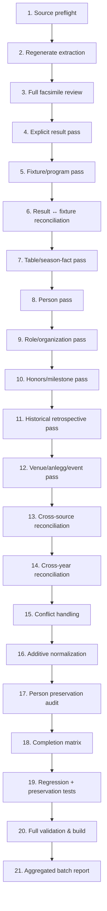

# Runbook: Historisk kildeinnhøsting og visuell primærkildekontroll

Dette dokumentet er den **autoritative produksjonsstandarden** for manuell og semi-maskinell innhøsting av historiske trykte publikasjoner i AaFK-arkivet.

Standarden er kildeagnostisk og gjelder for alle sidebaserte historiske kilder:
- Medlemsblad og klubbaviser
- Årbøker (f.eks. NFFs årbøker, kretsårbøker)
- Jubileumsbøker og festskrift (f.eks. 25-, 40-, 50- og 100-årsbøker)
- Årsrapporter og beretninger (f.eks. SFK årsrapporter, AaFK årsberetninger)
- Andre trykte publikasjoner, hefter og turneringsprogram

Runbooken beskriver ikke én bestemt årgang, men etablerer repoets faste regler for dataintegritet, kildehierarki, feltspesifikk proveniens, additivitet og kvalitetssikring.

---

## 1. Normativt språk

I denne runbooken gjelder følgende nøkkelord strengt:
- **MUST / SKAL:** Absolutt krav. Brudd er en merge-blocker.
- **MUST NOT / SKAL IKKE:** Forbudt praksis. Fører til data- eller arkitekturdrift og avvises i review.
- **SHOULD / BØR:** Sterkt anbefalt standardmetode. Avvik krever eksplisitt begrunnelse i reviewrapporten.
- **MAY / KAN:** Valgfri forbedring eller utvidelse når kildematerialet gir grunnlag for det.

Dette sikrer at agenter og bidragsytere skiller tydelig mellom **mergekrav**, **anbefalt arbeidsmetode** og **valgfrie utvidelser**.

---

## 2. Kildehierarki og kildekritikk

### Faksimile er primær representasjon

Arkivet bygger på det fysiske, trykte kildematerialet slik det foreligger i høyoppløselige faksimiler (skann).

OCR og ALTO-data fra digitale bibliotek (f.eks. Nasjonalbiblioteket) er utelukkende:
- søkehjelpemidler
- kandidatgeneratorer
- navigasjonsverktøy
- grunnlag for automatisert forhåndsanalyse

OCR/ALTO **SKAL IKKE** overstyre visuell kontroll av faksimilen.

Prioritetsregelen er:
```
Faksimile (visuelt kontrollert originaltrykk)
  > Korrekt manuelt lest tekst
    > Maskinell OCR / ALTO-tekst
      > Adapter- eller resolver-tolkning
```

> [!IMPORTANT]
> **Samtidighet er ikke ufeilbarlighet:** At en samtidig primærkilde hevder noe, betyr ikke automatisk at påstanden er historisk sannhet. Kildepåstanden skal bevares nøyaktig slik den er trykt i `data/source-results/`, mens kanoniske data fastsettes etter kildekritisk vurdering og eventuell avstemming mot andre kilder.

---

## 3. Standard 21-trinns arbeidsflyt

Innhøsting av en publikasjon eller årgang følger en fast produksjonsløype i 21 steg:



### Steg 1: Source preflight
- **Input:** Kildedefinisjoner i `data/sources/*.yaml` og provider-metadata.
- **Leter etter:** Korrekt `sourceId`, URN/URL, sidetall (`pagesExpected` vs `pagesProcessed`), skannummer vs trykt sidetall, ALTO-tilgjengelighet, opphavsrett og proveniens.
- **Tillatte sluttilstander:** Kilden er entydig identifisert, validert og registrert i kildekatalogen.
- **Typiske feil:** Forveksling av skannummer og trykt sidetall; starte innhøsting av feil hefte eller en reprint uten å vite det.
- **Definition of Done:** Preflight-sjekkliste i reviewrapporten er utfylt uten ubesvarte punkter.

### Steg 2: Regenerate extraction (arbeidskø)
- **Input:** Publikasjonens råtekst/ALTO og `nb-extract`-pipeline.
- **Leter etter:** Genererte maskinelle kandidater for kamper, personer, roller og lagoppstillinger.
- **Tillatte sluttilstander:** `data/extractions/<sourceId>.yaml` er oppdatert som maskinell arbeidskø.
- **Typiske feil:** Å tro at extraction-filen er et ferdig datasett fremfor en kandidatliste.
- **Definition of Done:** Uttrekk er kjørt og logget, klar til visuell verifisering.

### Steg 3: Full facsimile review
- **Input:** Samtlige sider i publikasjonen (faksimilevisning / høyoppløselig PDF).
- **Leter etter:** All sportslig og organisatorisk informasjon på hver enkelt side.
- **Tillatte sluttilstander:** 100 % av sidene er visuelt kontrollert og logget i kontrollmatrisen.
- **Typiske feil:** Å bare se på sider som har maskinelle kandidater.
- **Definition of Done:** Reviewloggen inneholder en komplett side-for-side-tabell (`X / X sider visuelt kontrollert`).

### Steg 4: Explicit result pass
- **Input:** Spaltemeldinger, kampreferater og tabelloppsett.
- **Leter etter:** Eksplisitt dokumenterte samtidige kampresultater for A-laget (motstander, score, dato, bane, turnering).
- **Tillatte sluttilstander:** Hvert resultat er registrert som en kildepåstand i `data/source-results/<år>-<sourceId>.yaml`.
- **Typiske feil:** Å opprette en kanonisk kampfil direkte før kildepåstanden er sikret; å gjette ukjent dato.
- **Definition of Done:** Samtlige trykte samtidige resultater er registrert i source-results med trykt sidetall.

### Steg 5: Fixture/program pass
- **Input:** Terminlister, sesongprogrammer og kampannonser.
- **Leter etter:** Planlagte kamper, motstandere, rekkefølge, runder og planlagte datoer.
- **Tillatte sluttilstander:** Terminlister er registrert som `fixture_list`-objekter og vurdert mot resultatene.
- **Typiske feil:** Å anta at en terminliste beviser at kampen ble spilt på planlagt dato.
- **Definition of Done:** Alle terminlister er ekstrahert med eksplisitt angivelse av planlagte felt.

### Steg 6: Result ↔ fixture reconciliation
- **Input:** Dokumenterte resultater (steg 4) og terminlister (steg 5).
- **Leter etter:** Samsvar mellom planlagt oppsett og faktisk spilt kamp (motstander, hjemme/borte, rekkefølge, sesonghalvdel).
- **Tillatte sluttilstander:** Entydig kobling mellom planlagt termin og spilt kamp, eller identifisering av flyttet/utsatt kamp.
- **Typiske feil:** Å overskrive faktisk spilledato med en planlagt dato fra våren; å koble feil kamp ved dobbeltoppgjør.
- **Definition of Done:** Reconciliation-seksjonen i reviewrapporten dokumenterer koblingen for hver enkelt kamp.

### Steg 7: Table/season-fact pass
- **Input:** Trykte tabeller, sesongfasiter, målforskjeller og kildearitmetikk.
- **Leter etter:** Totaler for A-laget (kamper, V-U-T, målforskjell, poeng).
- **Tillatte sluttilstander:** Sesongtotaler er registrert som kontrollsum (checksum). Trykte regnefeil i kilden er bevart og kommentert.
- **Typiske feil:** Å bruke sesongsummer til å regne ut ukjente enkeltkamper matematisk; å korrigere trykkfeil i stillhet.
- **Definition of Done:** Sesongsummen er avstemt mot antall eksplisitte kamper, og eventuelle kildearitmetiske avvik er notert.

### Steg 8: Person pass
- **Input:** Løpende tekst, portretter, omtaler og lister.
- **Leter etter:** Spillere, ledere, tillitsvalgte, æresmedlemmer og andre sentrale klubbpersoner.
- **Tillatte sluttilstander:** Personene er identifisert mot eksisterende personregister eller vurdert for opprettelse.
- **Typiske feil:** Å opprette duplikatpersoner ved navnevarianter; å overse ukjente nøkkelpersoner.
- **Definition of Done:** Alle personfunn har en formell disposisjon (`person_created`, `person_enriched`, `identity_uncertain` etc.).

### Steg 9: Role/organization pass
- **Input:** Årsmøtereferater, styrelister, komitélister og treneromtaler.
- **Leter etter:** Formenn, styremedlemmer, oppmenn, trenere, banekomité, dameavdeling og krets/forbundsverv.
- **Tillatte sluttilstander:** Roller er registrert i personfiler og/eller i årlige organisasjonssnapshots (`data/organizations/`).
- **Typiske feil:** Å forskyve valgår til feil arbeidsår; å modernisere historisk terminologi (f.eks. endre oppmann til trener).
- **Definition of Done:** Hovedstyre og nøkkelroller er strukturert med kildehenvisning og korrekt funksjonsår.

### Steg 10: Honors/milestone pass
- **Input:** Jubileumsartikler, tildelinger, merkeoversikter og hedersomtale.
- **Leter etter:** Gullmerker, hedersbevisninger (f.eks. Kruset), æresmedlemskap, 100/200-kampers spillemerker, jubileer.
- **Tillatte sluttilstander:** `honors` og `milestones` er registrert direkte på personfilen med tildelingsår og kilde.
- **Typiske feil:** Å gjemme hederstildelinger i fritekstkommentarer i stedet for strukturerte felter.
- **Definition of Done:** Alle dokumenterte utmerkelser er lagt inn i personfilenes `honors`-array.

### Steg 11: Historical retrospective pass
- **Input:** Jubileumsartikler, historiske tilbakeblikk og memoarer i publikasjonen.
- **Leter etter:** Dokumentasjon av kamper, personer og hendelser fra tidligere tiår.
- **Tillatte sluttilstander:** Kildepåstander er ført med sitt faktiske historiske år (`factYear`), aldri publikasjonsåret.
- **Typiske feil:** Å lagre et cupresultat fra 1933 under 1954 fordi det sto i et 1954-hefte.
- **Definition of Done:** Retrospektive fakta er reconciliert mot eksisterende historikk for det aktuelle året.

### Steg 12: Venue/anlegg/event pass
- **Input:** Anleggsrapporter, dugnadsnotiser, innvielsesartikler og festreferater.
- **Leter etter:** Banebygging (f.eks. Nørvebanen, Aksla, Kråmyra), klubbhus, banetiltak, jubileumsfester.
- **Tillatte sluttilstander:** Viktige milepæler er strukturert som `data/observations/<år>-<slug>.yaml` eller kildeberiket på arenaen.
- **Typiske feil:** Å overse store klubbhistoriske hendelser som ikke er rene kamper eller personroller.
- **Definition of Done:** Observasjoner er opprettet for dokumenterte milepæler med korrekt dato og kildereferanse.

### Steg 13: Cross-source reconciliation
- **Input:** Samtidige kilder (f.eks. medlemsblad vs. SFK årsrapport vs. dagsaviser vs. NFF årbok).
- **Leter etter:** Samstemmighet eller uenighet om datoer, resultater, målscorere og verv.
- **Tillatte sluttilstander:** Samstemte fakta styrker kanoniske data; motstridende fakta dokumenteres som konflikter.
- **Typiske feil:** Å slette en kildepåstand fordi en annen kilde hevder noe annet.
- **Definition of Done:** Forskjeller mellom kilder er eksplisitt notert og håndtert etter konfliktreglene.

### Steg 14: Cross-year reconciliation
- **Input:** Tilstøtende årganger og publiserte flerårsoversikter.
- **Leter etter:** Kontinuitet i roller, kamprekker, karrierestatistikk og turneringsforløp (høst/vår-sesonger).
- **Tillatte sluttilstander:** Overganger mellom sesonghalvdeler og flerårige styreperioder henger logisk sammen.
- **Typiske feil:** Å registrere hull i en flerårig rolle fordi ett hefte manglet styrelisten.
- **Definition of Done:** Årsoverganger er avstemt mot forrige og neste batch.

### Steg 15: Conflict handling
- **Input:** Uenigheter mellom kilder identifisert i steg 13 og 14.
- **Leter etter:** Forskjeller i fødselsdatoer, resultater, verv og tildelingsår.
- **Tillatte sluttilstander:** Konflikter er registrert i `conflicts`-blokken på personen eller kampen med `resolved: false` eller `resolved: true` (med begrunnelse).
- **Typiske feil:** Å fjerne konfliktblokken for å "rydde opp".
- **Definition of Done:** Både uløste og løste konflikter er bevart med full proveniens for alle involverte parter.

### Steg 16: Additive normalization
- **Input:** Alle nye funn og eksisterende YAML-filer i `data/`.
- **Leter etter:** Berikelse av eksisterende person-, kamp-, sesong- og organisasjonsfiler.
- **Tillatte sluttilstander:** Nye fakta legges til additivt uten at noen eksisterende felter går tapt.
- **Typiske feil:** Å overskrive en hel personfil med en minimal versjon som bare inneholder årets nye rolle.
- **Definition of Done:** Full diff viser utelukkende additive endringer og velbegrunnede korreksjoner.

### Steg 17: Person preservation audit
- **Input:** `git diff data/people/`.
- **Leter etter:** Utilsiktet tap av roller, kilder, konflikter, kallenavn, trenerperioder (`coachSpells`) eller metadata.
- **Tillatte sluttilstander:** Null uforklarlige slettinger.
- **Typiske feil:** Å stole på at en editor eller et script ikke har fjernet eldre blokker.
- **Definition of Done:** Manuell og automatisert diff-audit bekrefter at all eksisterende historikk består.

### Steg 18: Completion matrix
- **Input:** Samtlige tall og funn fra batchen.
- **Leter etter:** Målbare metrikker for alle kategorier i innhøstingen.
- **Tillatte sluttilstander:** En fullstendig utfylt completion-matrise i reviewrapporten.
- **Typiske feil:** Å oppgi vage formuleringer ("mange personer funnet") i stedet for eksakte tall.
- **Definition of Done:** Matrisen er komplett med sammenlignbare tall for alle år i batchen.

### Steg 19: Regression + preservation tests
- **Input:** Sentinel-personer og sentrale kamper berørt av batchen.
- **Leter etter:** Verifisering av at både nye fakta finnes og at eksisterende historikk er uendret.
- **Tillatte sluttilstander:** Automatiserte regresjonstester i `packages/db` eller `packages/schema` kjører grønt.
- **Typiske feil:** Å bare teste at ny kode bygger, uten å teste dataintegritet på tvers av lag.
- **Definition of Done:** Tester kjører og passerer i testsuiten.

### Steg 20: Full validation & build
- **Input:** Hele arkivet og byggekoden.
- **Leter etter:** Skjemavalidering, dataintegritet, duplikater, uavklarte motstandere, selvmotsigelser og typefeil.
- **Tillatte sluttilstander:** Alle sjekker og bygg i repoets valideringsstandard er 100 % grønne.
- **Typiske feil:** Å glemme å bygge databasen eller overse advarsler fra `data:contradictions`.
- **Definition of Done:** Valideringsskriptene rapporterer null feil.

### Steg 21: Aggregated batch report
- **Input:** Enkeltår-reviews og samlet completion-matrise.
- **Leter etter:** Helhetlig dokumentasjon av periodens sportslige, administrative og anleggsmessige utvikling.
- **Tillatte sluttilstander:** En samlet rapportfil i `docs/data/` klar for PR-review.
- **Typiske feil:** Å levere en PR uten samlet oversikt over hva batchen har tilført arkivet.
- **Definition of Done:** Batchrapporten er ferdigstilt og lenket i PR-beskrivelsen.

---

## 4. Dispositions-vokabular

For å sikre sporbarhet og stringens **SKAL** alle relevante funn klassifiseres med en eksplisitt disposisjon.

> [!WARNING]
> Statusen `reviewed` er et prosess-stadium i sidetabellen, **IKKE** en gyldig endelig disposisjon for et identifisert historisk funn.

### Disposisjoner for kamp og sportslige oppgjør

| Disposisjon | Betydning | Handling i arkivet |
|---|---|---|
| `source_result_created` | Nytt eksplisitt kampresultat funnet i kilden | Opprettes i `data/source-results/` |
| `canonical_created` | Sikker kampidentitet etablert for første gang | Ny kampfil i `data/seasons/<år>/matches/` |
| `canonical_enriched` | Eksisterende kanonisk kamp tilført nye felt/kilde | Felt og kildehenvisning lagt til i kampfil |
| `fixture_only` | Bare planlagt terminlisteoppføring funnet | Registrert i kilde/review, ikke som spilt kamp |
| `outcome_only` | Kamp nevnt med utfall (f.eks. seier), men uten score | Kildepåstand i source-results / notis |
| `result_without_date` | Konkret score dokumentert, men eksakt dato mangler | Bevares i source-results uten konstruert dato |
| `date_without_result` | Spilledato dokumentert, men sluttresultat mangler | Bevares som kildeobservasjon / source-result |
| `already_documented` | Kampen er fullverdig dokumentert fra eldre primærkilde | Kildehenvisning legges til dersom relevant |
| `duplicate_publication` | Identisk opptrykk / reprint fra annen kilde | Merkes som reprint i source-results |
| `identity_uncertain` | Usikkerhet om motstander, år eller lag | Dokumenteres i review, ingen kanonisk kobling |
| `not_a_team` | Kampen gjelder internt oppgjør, oppvisning e.l. | Noteres i review, ikke kanonisk A-kamp |
| `no_structured_action` | Generell tekst/omtale uten nye strukturerbare fakta | Ingen endring i YAML |

### Disposisjoner for personer og roller

| Disposisjon | Betydning | Handling i arkivet |
|---|---|---|
| `person_created` | Ny person med verifisert virke i klubben | Ny fil i `data/people/<slug>.yaml` |
| `person_enriched` | Eksisterende person tilført nye fakta/kilder | Additiv oppdatering av eksisterende personfil |
| `role_created` | Nytt styre-, trener- eller komitéverv | Lagt til i personens `roles` og ev. snapshot |
| `role_enriched` | Eksisterende rolle tilført kilde eller merknad | Kilde lagt til på eksisterende rolle |
| `honor_created` | Ny hedersbevisning eller spillemerke funnet | Lagt til i personens `honors`-liste |
| `honor_enriched` | Eksisterende hederstilfelle kildebelagt | Kilde lagt til på eksisterende honor |
| `milestone_created` | Karrieremilepæl (f.eks. kampantall, jubileum) | Strukturert på person eller i observation |
| `mention_linked` | Omtale av person knyttet som kildereferanse | Lagt til i personens `sources`-liste |
| `observation_created` | Historisk hendelse der personen var sentral | Opprettet i `data/observations/` |
| `already_documented` | Rollen/faktumet er allerede fullt dokumentert | Kildehenvisning berikes ved behov |
| `identity_uncertain` | Navnelikhet eller uklar personidentitet | Registreres ikke som ny person før avklart |
| `no_structured_action` | Omtale uten varig historisk/statistisk verdi | Ingen endring i YAML |

---

## 5. Source-results og kanoniseringsregler

### Source-result som kildepåstand
Et kildedokumentert kampresultat **SKAL** først registreres som en kildepåstand i `data/source-results/<år>-<sourceId>.yaml`.

Et source-result betyr:
> *"Denne kilden påstår at denne kampen ble spilt med dette resultatet."*

Det betyr **IKKE** at arkivet har erklært resultatet som den endelige, kanoniske sannheten.

### Kanonisering krever entydig identitet
En kanonisk kampfil i `data/seasons/<år>/matches/` representerer arkivets omforente faktagrunnlag.

En kanonisk kamp **SKAL IKKE** opprettes på grunnlag av:
1. En terminliste (`fixture_list`) alene.
2. En sesongtotal eller tabellsum alene.
3. Matematisk utledning fra målforskjell eller poeng.
4. Usikker retrospektiv omtale uten motstander eller årstall.
5. Antatt eller gjettet kamprekkefølge.

Ved den minste usikkerhet **SKAL** kildepåstanden bevares trygt i `data/source-results/`, og kanonisering utsettes til uavhengig bekreftelse foreligger.

---

## 6. Feltspesifikk proveniens

Arkivet krever full sporbarhet helt ned på feltnivå. 

En kilde **SKAL BARE** tilskrives de feltene den faktisk dokumenterer på den oppgitte siden.

```yaml
# RIKTIG: Hver kilde har sine spesifikke felt
sources:
  - sourceId: medlemsblad-for-aalesunds-fotb-1954-cd1c
    page: "95"
    fields:
      - date
      - home.score
      - away.score
    note: "Sesongoppsummeringen s. 95 oppgir Freidig–AaFK 3–1 i NM 3. runde."

  - sourceId: sunnmore-arbeideravis-19540809-a1b2
    page: "4"
    fields:
      - attendance
      - halfTimeScore
      - lineups.away.starters
    note: "Kampreferat med lagoppstilling og pause 1–0."
```

```yaml
# FORBUDT: Å gi én kilde proveniens for felt den ikke omtaler
sources:
  - sourceId: medlemsblad-for-aalesunds-fotb-1954-cd1c
    page: "95"
    fields:
      - date
      - attendance       # FEIL: Siden nevner ikke tilskuertall!
      - lineups          # FEIL: Siden har ingen lagoppstilling!
```

---

## 7. Terminlister og planlagte datoer

Terminlister dokumenterer hva som var *planlagt* da publikasjonen gikk i trykken.

Følgende regler gjelder strengt:
1. **Planlagt dato er ikke faktisk dato:** En terminliste gir `plannedDate`. Den beviser ikke alene at kampen fant sted den dagen.
2. **Actual evidence vinner:** Hvis et kampreferat, en avisrapport eller et styremøtereferat viser at kampen ble spilt en annen dato (f.eks. flyttet pga. baneforhold eller båtruter), er det den **faktiske datoen** som skal stå i det kanoniske datofeltet.
3. **Bevaring av planlagt opplysning:** Den opprinnelige terminliste-påstanden kan bevares i kildens source-results eller i notater.
4. **Ingen tvangskobling:** Kampresultater skal aldri presses inn på en terminlistedato dersom kronologien eller andre kilder tilsier at kampen ble utsatt.

---

## 8. Sesongsummer og kildearitmetikk

Sesongstatistikker og tabelloppsummeringer trykt i kildene fungerer som **kontrollsummer (checksums)**.

1. **Ikke matematisk rekonstruksjon:** Hvis en kilde oppgir "28 kamper spilt", men bare lister 12 enkeltresultater, **SKAL IKKE** de resterende 16 kampene diktes opp eller konstrueres matematisk.
2. **Bevaring av kildens egne regnefeil:** Historiske kilder summerer ofte feil (f.eks. feil i målforskjell eller seire). 
   - Den trykte verdien (`printedValue`) **SKAL** bevares.
   - Den korrigerte verdien (`recomputedValue`) dokumenteres ved siden av.
   - Det **SKAL** legges inn en eksplisitt merknad (`arithmeticNote`).
3. **Ingen stille korrigering:** En historisk kilde skal aldri "pyntes på" i stillhet.

---

## 9. Retrospektive fakta og opptrykk (reprints)

### Publikasjonsår vs. Faktisk år
En historisk publikasjon publisert i år $X$ inneholder svært ofte artikler om hendelser i år $Y$.

Agenten **SKAL ALLTID** skille:
- `sourcePublicationYear` (året publikasjonen ble trykt)
- `factYear` (året hendelsen faktisk fant sted)

*Eksempel:* En artikkel i *AaFK Medlemsblad 1954* som omtaler cupbragden mot Skeid på Bislett i 1938 skal føres som et `source-result` for sesongen **1938** med kildepeker til 1954-publikasjonen.

### Reprint-regelen
Når to publikasjoner inneholder identisk tekst (f.eks. et jubileumshefte og et ordinært medlemsbladnummer som trykker samme artikkel):
1. Begge kildepåstander kan registreres dersom det har proveniensverdi.
2. Disposisjonen **SKAL** merkes eksplisitt som `duplicate_publication` / `reprint`.
3. Tekstene **SKAL IKKE** behandles som to uavhengige bekreftelser av faktumet.
4. Reviewrapporten **SKAL** dokumentere reprint-forholdet.

---

## 10. Personhistorikk og roller

### Personhistorikk er førsteklasses data
Viktige personfunn skal ikke bare begraves i en reviewtekst. De skal løftes inn i strukturerte data slik at de blir synlige på personens side på nettstedet:
- Verv og funksjoner (`roles`)
- Hedersbevisninger og spillemerker (`honors`)
- Historiske observasjoner (`data/observations/`)
- Kildereferanser og omtaler (`sources`)

### Historisk rolleterminologi
Historisk ordbruk **SKAL** bevares. Ikke moderniser eller oversett titler anakronistisk:
- `oppmann` **SKAL IKKE** automatisk bli `trener`
- `instruktør` **SKAL IKKE** automatisk bli `hovedtrener`
- `lagleder` **SKAL IKKE** endres til `oppmann`
- `fotballformann` **SKAL IKKE** bli `trener`

Organ/komité (`body`) skal alltid spesifiseres når kilden oppgir dette (f.eks. `body: "Banekomiteen"`, `body: "Dameavdelingen"`, `body: "Eldres avdeling"`).

### Valgår vs. arbeidsår
Årsmøter i idrettslag avholdes tradisjonelt i november eller desember.
- En person som blir *"valgt på årsmøtet 29. november 1953"* blir normalt valgt for **arbeidsåret 1954**.
- `role.from` skal da settes til `1954`, med mindre kilden eksplisitt sier at vedkommende overtok et restverv for 1953.
- Organisasjonssnapshot for 1953 (`1953-aafk.yaml`) skal ikke inneholde et styre som først tiltrådte for sesongen 1954.

### Snapshots og personfiler
- `data/organizations/<år>-<klubb>.yaml` dokumenterer et observert organisasjonsbilde for det gitte året.
- Et snapshot gir et tidsbilde, men erstatter ikke personfilen. En rolle som skal vises på en personside må også normaliseres i personens `data/people/<slug>.yaml`.

---

## 11. Additivitetsgaranti og slettekontroll

Additivitet er et **absolutt mergekrav**.

```
Eksisterende personfil
  + Nye kildefakta fra batchen
    + Målrettede, dokumenterte korreksjoner
      = Oppdatert personfil
```

Når en eksisterende person berikes, **SKAL** følgende bevares intakt:
- Eksisterende roller (`roles`)
- Eksisterende kilder (`sources`)
- Eksisterende konflikter (`conflicts`, både løste og uløste)
- Navnevarianter og kallenavn (`aliases`, `names`)
- Trenerperioder (`coachSpells`)
- Posisjon, fødsels-/dødsdato og eksterne ID-er (`wikidataId` etc.)
- Notater og metadata

> [!CAUTION]
> **Sletting er en merge-blocker:** Enhver fjerning av eksisterende data krever eksplisitt begrunnelse i PR-beskrivelsen. Uforklarlig fjerning av historikk fører til umiddelbar avvisning av PR-en.

---

## 12. Håndtering av historiske konflikter

Når to kilder oppgir motstridende opplysninger (f.eks. ulikt fødselsår, to ulike formenn samme år, ulikt kampresultat):
1. **Konflikten er et historisk faktum:** Uenigheten skal registreres i `conflicts`-strukturen.
2. **Bevaring av claims:** Både kilde A og kilde B sine påstander skal dokumenteres i konflikten.
3. **Løste vs. uløste konflikter:**
   - `resolved: false`: Uavklart konflikt.
   - `resolved: true`: Avklart konflikt, med `chosenValue` og grundig `reason`.
4. **Ingen sletting ved løsning:** Når en konflikt løses, skal **IKKE** konfliktblokken slettes som "opprydding". Dokumentasjonen på at kildene sprikte er verdifull arkivhistorikk.

---

## 13. Preservation audit og regresjonstester

### Preservation audit
Før en PR erklæres ferdig, **SKAL** agenten kjøre en grundig diff-kontroll:
```sh
git diff data/people/
```
Kontroller linje for linje at ingen eksisterende roller, kilder eller konfliktblokker er forsvunnet.

### Preservation regressionstester
For hver større kildebatch som berører eksisterende personer eller historiske sesonger, **BØR** det velges ut **sentinel-personer** (vaktpersoner).

En test skal verifisere:
1. **At det nye faktumet finnes.**
2. **At eldre roller/fakta på samme person fortsatt består uendret.**
3. **At eventuelle eksisterende konflikter på personen ikke er overskrevet.**

---

## 14. Ikke-A-lag og aldersbestemte klasser

Det må skilles skarpt mellom klubbens ulike lag og avdelinger:
- Senior A-lag (herrer)
- Senior B-lag / reservelag / rekrutt
- Damefotball / Dameavdelingen
- Juniorlag
- Guttelag / Småguttelag / Lillegutt
- Old Boys / Veteranlag
- Bymannskap / Kretslag / Kombinerte representasjonslag

> [!IMPORTANT]
> Et resultat i en historisk kilde der "Aalesund" eller "AaFK" inngår, er **IKKE** automatisk en tellende A-lagskamp. Junior- og B-kamper skal aldri føres inn som kanoniske A-lagskamper.

---

## 15. Completion-matrise (standardmetrikker)

Hver kilde og batch **SKAL** dokumenteres med en standardisert completion-matrise for å sikre sammenlignbarhet og etterrettelighet.

Følgende metrikker er obligatoriske:
- **Sider visuelt kontrollert:** Antall sider gjennomgått mot faksimile (f.eks. `92/92`).
- **A-lagskamper oppgitt i sesongfasit:** Totaler oppgitt i kildens årsberetning/tabell.
- **Eksplisitte samtidige A-lagsresultater:** Konkrete enkeltkamper med score i årgangen.
- **Retrospektive individuelle kildepåstander:** Historiske kamper fra tidligere år nevnt i teksten.
- **Kildedokumenterte oppgjør normalisert i source-results:** Totalt antall poster opprettet i `data/source-results/`.
- **Fixture-kilder vurdert:** Antall terminlister/programmer gjennomgått.
- **Nye canonical matches:** Nye kamper opprettet i `data/seasons/`.
- **Berikede canonical matches:** Eksisterende kamper tilført nye felter/kilder.
- **Nye personer opprettet:** Nye personfiler i `data/people/`.
- **Unike eksisterende personfiler beriket:** Antall eksisterende personer tilført data.
- **Personroller opprettet eller beriket:** Roller lagt til i personfiler.
- **Honors og milepæler:** Tildelte merker, æresmedlemskap og jubileer.
- **Mentions vurdert eller knyttet:** Omtaler koblet til personfiler.
- **Historical observations:** Observasjoner opprettet i `data/observations/`.
- **Organisasjonssnapshots:** Filer opprettet i `data/organizations/`.
- **Konflikter løst / åpne:** Antall kildekonflikter registrert.
- **Identity uncertain:** Personer/kamper med uavklart identitet.
- **Duplicate / reprint:** Antall identifiserte opptrykk/duplikater.

*Bruk tankestrek (`—`) dersom en metrikk ikke er relevant for den aktuelle kilden.*

---

## 16. Valideringsstandard og ferdigkontroll

Før en PR kan ferdigmeldes eller merges, **SKAL** samtlige av følgende kommandoer kjøres og passere uten feil:

```sh
# 1. Validering av data og dataintegritet
pnpm validate
AAFK_DATA_DIR=fixtures/data pnpm validate

# 2. Integritets- og konsistensrapporter
pnpm data:duplicates
pnpm data:opponents-unresolved
pnpm data:contradictions

# 3. Databasebygg og avstemming mot views
pnpm db:build
AAFK_DATA_DIR=fixtures/data pnpm db:build

# 4. Typekontroll, linting og enhetstester
pnpm typecheck
pnpm lint
pnpm test

# 5. Applikasjonsbygg og røyktest
pnpm build
pnpm smoke
```

Dersom ingest-pakken er modifisert, **SKAL** også følgende kjøres:
```sh
pnpm --filter @aafkstats/ingest test
```

---

## 17. Kryssreferanse til maskinløypa

Denne runbooken dekker den **redaksjonelle og kildekritiske primærkildeinnhøstingen**.

For den helautomatiske maskinelle uttrekkspipelinen (ALTO-spaltelesing, maskinell kandidatgenerering og masseoppslag mot NB-API-er), se:
- [`NB_RESOLVE_RUNBOOK.md`](NB_RESOLVE_RUNBOOK.md)

De to runbookene komplementerer hverandre: maskinløypa forbereder kandidater og spaltetekst, mens denne runbooken sikrer sannhet, proveniens, additivitet og fullstendig verifisering.

---

## 18. Definition of Done (DoD) for en innhøstings-PR

En innhøstings-PR er ferdig og klar til merge når:
1. **Full visuell kontroll:** 100 % av sidene i omfanget er visuelt kontrollert mot faksimile.
2. **Reviewlogg:** Det foreligger en fullstendig reviewlogg i `docs/data/` basert på [`HISTORISK_KILDE_REVIEW_TEMPLATE.md`](data/HISTORISK_KILDE_REVIEW_TEMPLATE.md).
3. **Batchrapport:** Ved batcher over flere år foreligger en samlet rapport basert på [`HISTORISK_KILDE_BATCH_TEMPLATE.md`](data/HISTORISK_KILDE_BATCH_TEMPLATE.md).
4. **Ingen udokumentert kanonisering:** Ingen kanoniske kamper eller personer er opprettet uten tilstrekkelig kildedekning.
5. **Additivitet bekreftet:** Preservation audit bekrefter null uforklarlig tap av eksisterende person-, rolle- eller konfliktdata.
6. **Validering grønn:** Samtlige sjekker i valideringsstandarden (seksjon 16) passerer med null feil.
7. **Klar commit-historikk:** Commits er skrevet på norsk imperativ og dokumenterer innhøstingsarbeidet presist.
