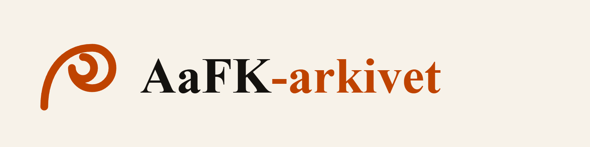

# Merkevarepakken

Merket bygger på jugendvolutten som allerede brukes i AaFK-arkivet. Fargene og
typografien følger nettstedet, slik at appikon, README og eksterne flater har samme
uttrykk som selve arkivet.

## Filer og bruk

| Fil | Størrelse | Bruk |
|---|---:|---|
| [`avatar-800.png`](assets/avatar-800.png) | 800 × 800 | Profilbilde på GitHub og sosiale medier |
| [`lockup-horizontal-cream.png`](assets/lockup-horizontal-cream.png) | 1600 × 400 | Lys flate, presentasjon og e-post |
| [`lockup-horizontal-dark.png`](assets/lockup-horizontal-dark.png) | 1600 × 400 | Mørk flate |
| [`lockup-stacked-cream.png`](assets/lockup-stacked-cream.png) | 900 × 900 | Kvadratiske flater |
| [`readme-banner-1280x320.png`](assets/readme-banner-1280x320.png) | 1280 × 320 | Toppbanner i prosjektets README |

Appikonene som nettstedet bruker, ligger nær koden:

- `apps/web/app/icon.png` og `apple-icon.png` oppdages automatisk av Next.js.
- `apps/web/public/icons/` inneholder favicon-, PWA- og splash-varianter.
- `apps/web/app/manifest.ts` beskriver PWA-ikonene og installasjonsopplevelsen.

## Farger og typografi

| Rolle | Lys | Mørk |
|---|---|---|
| Bakgrunn | `#f7f2e9` | `#14120f` |
| Tekst | `#16130f` | `#f2ece4` |
| Aksent | `#bf4300` | `#ff7a3d` |

Navnetrekket bruker en klassisk seriff i grafikken. Nettstedet fortsetter å bruke
systemfonter og laster ikke inn en egen fontfil.

## Retningslinjer

- Bruk lys variant på lyse flater og mørk variant på mørke flater.
- Ikke strekk, roter eller endre proporsjonene.
- La det være luft rundt merket; ikke legg tekst eller andre logoer tett inntil.
- Bruk appikonet uten navnetrekk når flaten er liten eller kvadratisk.
- AaFK-arkivet er et uoffisielt supporterprosjekt. Merket skal ikke fremstilles som
  Aalesunds Fotballklubbs offisielle identitet.

Merkevarefilene er prosjektets egen grafikk og er tilgjengelige under
[CC BY 4.0](../../DATA_LICENSE.md). Krediter «AaFK-arkivet» med lenke til prosjektet.
